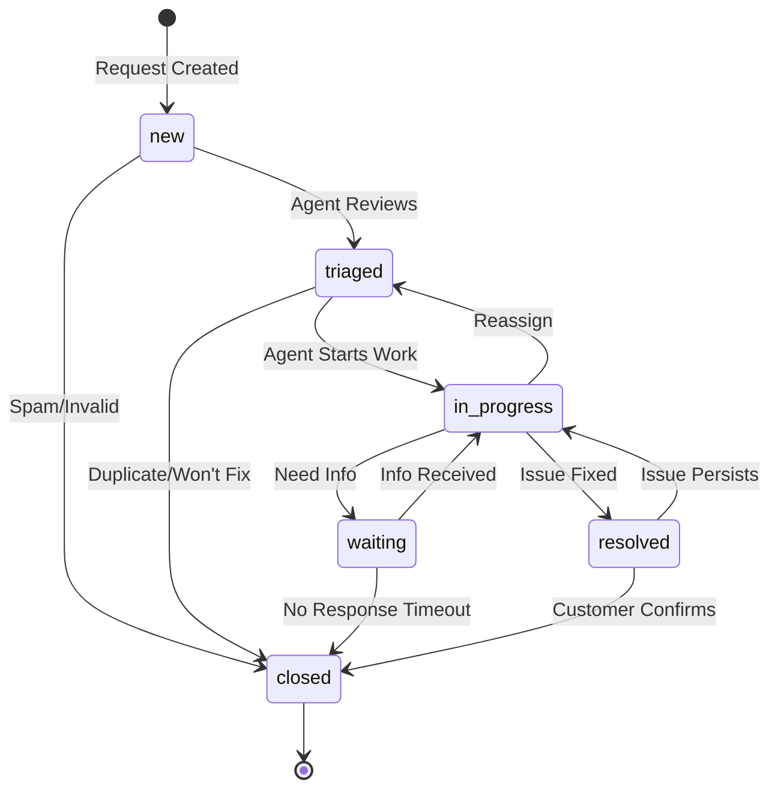

# Request Lifecycle

This document defines the state machine for support request status transitions.

## Status States

| Status | Description |
|--------|-------------|
| **new** | Initial state when request is created |
| **triaged** | Request has been reviewed and categorized |
| **in_progress** | Agent is actively working on the request |
| **waiting** | Waiting for external input (customer response, vendor, etc.) |
| **resolved** | Request has been resolved |
| **closed** | Request is closed (final state) |

## State Machine Diagram

## Valid Transitions

### From: new
- ✅ `new` → `triaged` - Agent reviews and categorizes
- ✅ `new` → `closed` - Spam or invalid request
- ❌ Cannot transition directly to `in_progress`, `waiting`, or `resolved`

### From: triaged
- ✅ `triaged` → `in_progress` - Agent begins work
- ✅ `triaged` → `closed` - Duplicate, won't fix, or invalid
- ❌ Cannot transition to `new`, `waiting`, or `resolved`

### From: in_progress
- ✅ `in_progress` → `waiting` - Waiting for customer or external input
- ✅ `in_progress` → `resolved` - Issue resolved
- ✅ `in_progress` → `triaged` - Reassignment or re-triage needed
- ❌ Cannot transition to `new` or directly to `closed`

### From: waiting
- ✅ `waiting` → `in_progress` - Customer provided information
- ✅ `waiting` → `closed` - No response timeout
- ❌ Cannot transition to `new`, `triaged`, or `resolved`

### From: resolved
- ✅ `resolved` → `closed` - Customer confirms resolution
- ✅ `resolved` → `in_progress` - Issue persists or reopened
- ❌ Cannot transition to `new`, `triaged`, or `waiting`

### From: closed
- 🔒 **Final state** - No transitions allowed
- Note: If reopening is needed, create a new request linking to the original

## Business Rules

1. **Automatic Transitions**
   - Requests in `waiting` status for >7 days auto-transition to `closed` (resolution_code: `wont_fix`)
   - Requests in `resolved` status for >3 days auto-transition to `closed` (resolution_code: `solved`)

2. **Required Fields by Status**
   - `triaged`: Must have `priority` assigned
   - `in_progress`: Must have `assigned_to` agent
   - `resolved`: Must have `resolution_code`
   - `closed`: Must have `resolution_code`

3. **Validation Rules**
   - Cannot remove `assigned_to` when status is `in_progress` or `waiting`
   - Cannot change `priority` to lower value when status is `in_progress`
   - `resolution_code` can only be set when status is `resolved` or `closed`

## Metrics & SLAs

Different priorities have different SLA targets for each status transition:

| Priority | First Response (new → triaged) | Resolution Time |
|----------|--------------------------------|-----------------|
| P0       | 15 minutes                     | 4 hours         |
| P1       | 1 hour                         | 24 hours        |
| P2       | 4 hours                        | 3 days          |
| P3       | 24 hours                       | 7 days          |

See [`priority-definitions.md`](priority-definitions.md) for detailed SLA definitions.
