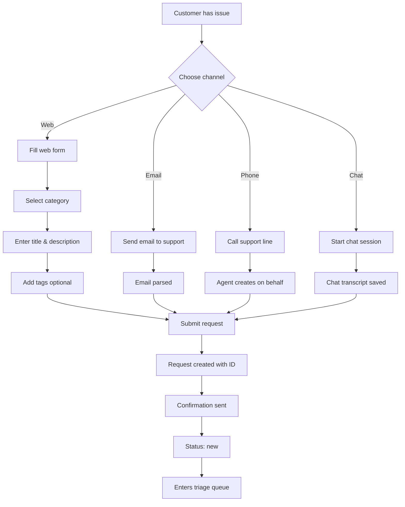

# US-01: Submit Support Request

**As a** customer/requester  
**I want to** submit a support request through multiple channels  
**So that** I can get help with my issues and questions

---

## Acceptance Criteria

### AC-1: Web Form Submission
- **Given** I am on the support request form
- **When** I fill in the required fields (title, description, category)
- **And** I click "Submit Request"
- **Then** a new request is created with status `new`
- **And** I receive a confirmation with the request ID (e.g., REQ-000123)
- **And** I receive an email confirmation within 5 minutes

### AC-2: Email Submission
- **Given** I send an email to support@example.com
- **When** the email is processed by the system
- **Then** a new request is created from the email subject (title) and body (description)
- **And** the channel is set to `email`
- **And** I receive an auto-reply with the request ID

### AC-3: Required Fields Validation
- **Given** I am submitting a request
- **When** I leave required fields empty
- **Then** I see validation errors indicating which fields are missing
- **And** the request is not submitted until all required fields are filled

### AC-4: Category Selection
- **Given** I am filling out the support form
- **When** I select a category
- **Then** I see relevant help articles or FAQs for that category
- **And** I can choose to continue with my request or find an answer in the articles

### AC-5: Priority Auto-Assignment
- **Given** I submit a request via phone
- **When** the request is created
- **Then** the system automatically suggests a higher priority (P1 or P2)
- **And** an agent can review and adjust if needed during triage

---

## User Flow



---

## Technical Requirements

### API Endpoint
```
POST /v1/requests
```

### Request Payload
```json
{
  "title": "Unable to login to my account",
  "description": "I've been trying to log in for the past hour but keep getting 'Invalid credentials' error...",
  "category": "technical",
  "requester_type": "paid",
  "channel": "web_form",
  "tags": ["login", "authentication"]
}
```

### Response (201 Created)
```json
{
  "id": "REQ-000123",
  "title": "Unable to login to my account",
  "description": "I've been trying to log in...",
  "category": "technical",
  "priority": "P2",
  "status": "new",
  "requester_type": "paid",
  "channel": "web_form",
  "created_at": "2026-02-04T14:30:00Z",
  "tags": ["login", "authentication"]
}
```

---

## Validation Rules

1. **Title**: 5-200 characters, not empty
2. **Description**: 10-5000 characters, meaningful content
3. **Category**: Must be one of: technical, account, billing, general
4. **Channel**: Auto-detected based on submission method
5. **Requester Type**: Determined from user's account plan

---

## Edge Cases

### EC-1: Duplicate Detection
- **Scenario**: User submits identical request within 24 hours
- **Behavior**: Warn user of potential duplicate, ask to confirm
- **Fallback**: Allow submission but flag for agent review

### EC-2: Spam Prevention
- **Scenario**: User submits >10 requests in 1 hour
- **Behavior**: Rate limit kicks in, block further submissions
- **Message**: "You've reached the request limit. Please wait before submitting more."

### EC-3: Offline Submission (Email)
- **Scenario**: Email server is down
- **Behavior**: Queue email for processing when service recovers
- **SLA**: Process within 1 hour of service recovery

### EC-4: Invalid Category
- **Scenario**: API client sends invalid category
- **Behavior**: Return 400 Bad Request with error message
- **Message**: "Invalid category. Must be one of: technical, account, billing, general"

---

## Success Metrics

- **Submission Success Rate**: >99% of valid requests successfully created
- **Time to Confirmation**: <5 seconds for web form, <5 minutes for email
- **Form Abandonment Rate**: <10% of users who start form
- **Channel Distribution**: Track usage across all channels

---

## Related Stories
- **US-02**: Agent Triage - what happens after submission
- **US-05**: Customer Self-Service - reducing request volume with FAQs

---

## Notes
- Consider adding attachment support in future iterations
- Mobile app submission to be added in Phase 2
- SMS channel planned for emergency contacts (enterprise only)
