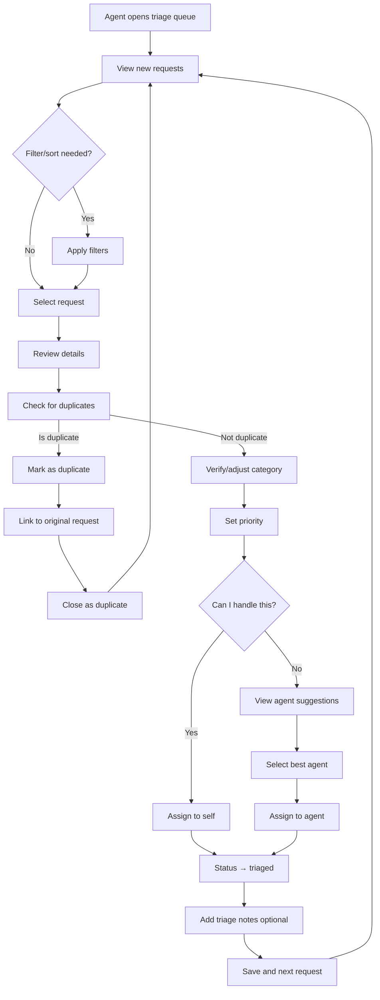

# US-02: Agent Triage and Assignment

**As a** support agent  
**I want to** efficiently triage incoming requests and assign them to the right team member  
**So that** requests are handled quickly and by the most appropriate person

---

## Acceptance Criteria

### AC-1: View Triage Queue
- **Given** I am logged in as an agent
- **When** I navigate to the triage queue
- **Then** I see all requests with status `new` sorted by:
  1. Suggested priority (high to low)
  2. Created timestamp (oldest first)
- **And** I can filter by category, channel, or requester type

### AC-2: Review Request Details
- **Given** I select a request from the triage queue
- **When** the request details panel opens
- **Then** I see:
  - Full title and description
  - Suggested priority and category
  - Requester information and type
  - Similar/duplicate requests (if any)
  - Relevant knowledge base articles
- **And** I can take action to triage the request

### AC-3: Set Priority
- **Given** I am reviewing a request
- **When** I set or adjust the priority
- **Then** the system shows SLA targets for that priority
- **And** I can optionally add a note explaining the priority decision
- **And** the priority is saved when I submit

### AC-4: Assign to Agent
- **Given** I have triaged a request
- **When** I assign it to an agent (myself or teammate)
- **Then** the status changes to `triaged`
- **And** the assigned agent receives a notification
- **And** I can see the agent's current workload before assigning
- **And** the request appears in the agent's work queue

### AC-5: Smart Assignment Suggestions
- **Given** I am assigning a request
- **When** I click on the assignment field
- **Then** I see suggested agents ranked by:
  1. Expertise in this category
  2. Current workload/capacity
  3. SLA urgency
- **And** I can override the suggestion with manual selection

### AC-6: Bulk Triage
- **Given** there are multiple similar requests in the queue
- **When** I select multiple requests (up to 10)
- **Then** I can apply the same action to all:
  - Set priority
  - Set category
  - Assign to agent
  - Mark as duplicate
- **And** the system confirms the bulk operation before applying

---

## User Flow



---

## Technical Requirements

### API Endpoint (Get Triage Queue)
```
GET /v1/requests/triage?limit=50
```

### Response
```json
{
  "data": [
    {
      "id": "REQ-000123",
      "title": "Cannot access billing dashboard",
      "description": "When I click on Billing...",
      "category": "billing",
      "priority": "P2",
      "status": "new",
      "requester_type": "enterprise",
      "channel": "web_form",
      "created_at": "2026-02-04T10:00:00Z",
      "suggested_priority": "P1",
      "similar_requests": ["REQ-000120"],
      "tags": ["billing", "dashboard"]
    }
  ],
  "count": 23
}
```

### API Endpoint (Update Request)
```
PATCH /v1/requests/{id}
```

### Request Payload
```json
{
  "priority": "P1",
  "status": "triaged",
  "assigned_to": "agent-042",
  "tags": ["billing", "dashboard", "enterprise"]
}
```

---

## Triage Decision Matrix

| Category | Requester Type | Keywords | Suggested Priority |
|----------|---------------|----------|-------------------|
| technical | enterprise | "outage", "down" | P0 |
| technical | any | "cannot login" | P1 |
| billing | any | "payment failed" | P1 |
| billing | enterprise | "invoice" | P2 |
| account | any | "password reset" | P2 |
| general | any | "how to" | P3 |

---

## Validation Rules

1. **Status Transition**: Only `new` → `triaged` or `new` → `closed` allowed
2. **Assignment Required**: When setting status to `triaged`, must assign to agent
3. **Priority Required**: Cannot save without setting priority
4. **Duplicate Linking**: When marking as duplicate, must link to original request

---

## Edge Cases

### EC-1: High Volume Event
- **Scenario**: System outage causes 500+ similar requests
- **Behavior**: System detects pattern and suggests bulk action
- **Action**: Agent can create single "master" request and mark all others as duplicates

### EC-2: No Available Agents
- **Scenario**: All agents at capacity for this category
- **Behavior**: System suggests agents from related teams
- **Escalation**: Manager notification if no agents available for P0/P1

### EC-3: Conflicting Priority Assessment
- **Scenario**: System suggests P1, agent wants to set P3
- **Behavior**: Allow override but require justification note
- **Audit**: Log all priority overrides for quality review

### EC-4: Request Already Being Triaged
- **Scenario**: Two agents open same request simultaneously
- **Behavior**: Show warning "Agent X is currently reviewing this request"
- **Action**: Allow viewing but lock editing until first agent completes

---

## Agent Dashboard Requirements

### Metrics Display
- **Triage Queue Count**: Total new requests by priority
- **My Current Workload**: Count by status and priority
- **SLA At Risk**: Requests approaching SLA breach
- **Team Performance**: Average triage time, SLA compliance

### Quick Actions
- "Assign to me" button on each request
- "Mark as duplicate" with quick search for original
- "Needs more info" button to transition to `waiting` with template

---

## Success Metrics

- **Triage Time**: Average time from `new` → `triaged`
  - Target: <15 min for P0, <1 hour for P1, <4 hours for P2, <24 hours for P3
- **Assignment Accuracy**: % of requests not reassigned within first hour
  - Target: >90%
- **Duplicate Detection Rate**: % of duplicates correctly identified
  - Target: >80%
- **Agent Utilization**: % of time agents within capacity limits
  - Target: 70-90% (not overloaded, not underutilized)

---

## UI/UX Requirements

### Triage Queue Table Columns
1. Priority (color-coded)
2. Request ID (clickable)
3. Title (truncated, expandable)
4. Category badge
5. Requester type badge
6. Time in queue
7. Quick action buttons

### Color Coding
- **P0**: Red background, white text
- **P1**: Orange background
- **P2**: Yellow background
- **P3**: Gray background

### Keyboard Shortcuts
- `Space`: Open request details
- `1-4`: Set priority P0-P3
- `A`: Assign to me
- `N`: Next request
- `D`: Mark as duplicate

---

## Related Stories
- **US-01**: Submit Request - where requests come from
- **US-03**: Manager Dashboard - oversight of triage performance
- **US-06**: Agent Workbench - working on assigned requests

---

## Notes
- Consider ML model for smarter priority suggestions based on historical data
- Future: Auto-triage for simple/common requests (e.g., password resets)
- Integration with knowledge base for suggesting articles to customers before escalating
