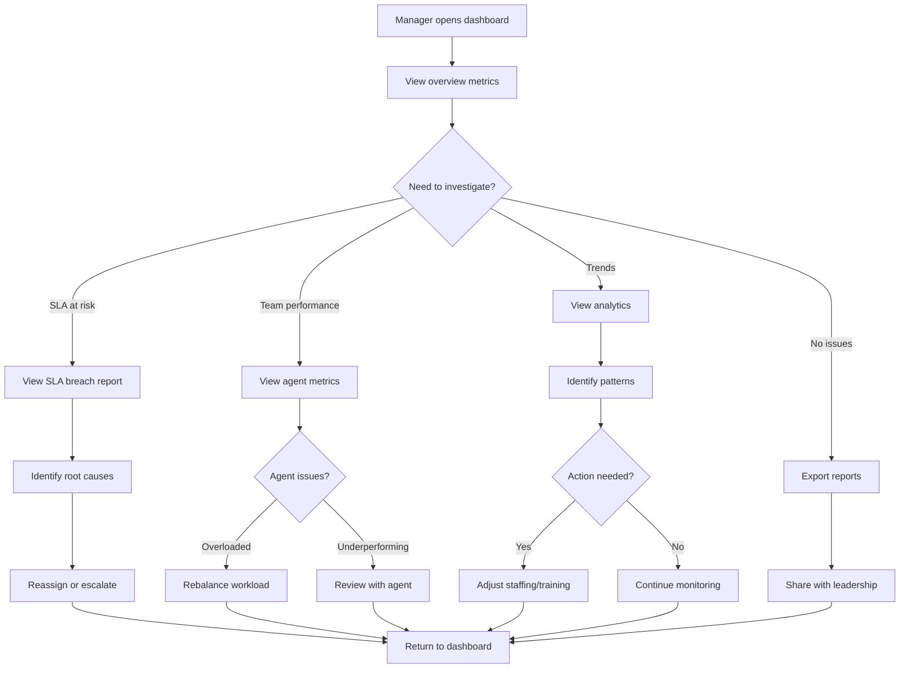

# US-03: Manager Dashboard and Analytics

**As a** support manager  
**I want to** view real-time metrics and insights about support requests  
**So that** I can monitor team performance, identify issues, and make data-driven decisions

---

## Acceptance Criteria

### AC-1: Overview Dashboard
- **Given** I am logged in as a manager
- **When** I navigate to the dashboard
- **Then** I see key metrics for the current day:
  - Total requests by status
  - Average response time by priority
  - SLA compliance rate
  - Requests at risk of SLA breach
  - Team utilization (agent workload)
- **And** metrics auto-refresh every 60 seconds

### AC-2: Filter by Time Period
- **Given** I am viewing the dashboard
- **When** I select a time period (today, last 7 days, last 30 days, custom range)
- **Then** all metrics update to reflect the selected period
- **And** I can compare with the previous period

### AC-3: Category and Priority Breakdown
- **Given** I want to understand request distribution
- **When** I view the breakdown charts
- **Then** I see:
  - Pie chart of requests by category
  - Bar chart of requests by priority
  - Trend line showing volume over time
- **And** I can click on any segment to drill down into those requests

### AC-4: SLA Compliance Tracking
- **Given** I need to monitor SLA performance
- **When** I view the SLA section
- **Then** I see:
  - Overall SLA compliance percentage
  - Compliance rate by priority level
  - List of requests currently breaching SLA
  - Projected breaches in next 24 hours
- **And** I can export the breach report as CSV

### AC-5: Team Performance Metrics
- **Given** I want to assess team productivity
- **When** I view the team performance section
- **Then** I see for each agent:
  - Current workload (requests in progress)
  - Average resolution time
  - SLA compliance rate
  - Number of requests resolved today/week
- **And** I can sort by any metric
- **And** I can identify agents who may need support

### AC-6: Trend Analysis
- **Given** I want to identify patterns
- **When** I view trend charts
- **Then** I see:
  - Request volume trends by day/week/month
  - Peak hours/days for submissions
  - Category trends over time
  - Resolution time trends
- **And** I can export charts as images for reports

---

## User Flow



---

## Technical Requirements

### API Endpoint (Get Metrics)
```
GET /v1/analytics/metrics?start_date=2026-02-01T00:00:00Z&end_date=2026-02-04T23:59:59Z&group_by=priority
```

### Response
```json
{
  "period": {
    "start": "2026-02-01T00:00:00Z",
    "end": "2026-02-04T23:59:59Z"
  },
  "total_requests": 342,
  "by_priority": {
    "P0": 5,
    "P1": 23,
    "P2": 156,
    "P3": 158
  },
  "by_category": {
    "technical": 145,
    "billing": 89,
    "account": 67,
    "general": 41
  },
  "by_status": {
    "new": 23,
    "triaged": 45,
    "in_progress": 67,
    "waiting": 34,
    "resolved": 89,
    "closed": 84
  },
  "sla_compliance": {
    "overall": 94.2,
    "by_priority": {
      "P0": 100.0,
      "P1": 95.7,
      "P2": 93.5,
      "P3": 91.8
    }
  },
  "avg_resolution_time_hours": {
    "P0": 2.3,
    "P1": 18.5,
    "P2": 45.2,
    "P3": 98.7
  },
  "requests_at_risk": [
    {
      "id": "REQ-000245",
      "priority": "P1",
      "sla_remaining_minutes": 45,
      "assigned_to": "agent-042"
    }
  ],
  "agent_performance": [
    {
      "agent_id": "agent-042",
      "agent_name": "John Doe",
      "active_requests": 8,
      "resolved_today": 5,
      "avg_resolution_hours": 12.3,
      "sla_compliance_rate": 96.2
    }
  ]
}
```

---

## Dashboard Sections

### 1. KPI Cards (Top of Dashboard)
```
┌──────────────┬──────────────┬──────────────┬──────────────┐
│ Total Reqs   │ SLA Complnce │ Avg Response │ At Risk      │
│   342        │   94.2%      │   2.3 hrs    │   12         │
│ ↑ 12% vs LW │ ↓ 1.2% vs LW │ ↓ 0.5h vs LW │ ⚠️           │
└──────────────┴──────────────┴──────────────┴──────────────┘
```

### 2. Request Volume Chart
- Line chart showing requests created over time
- Colored by priority
- Hover to see exact counts

### 3. Status Distribution
- Funnel chart showing requests in each status
- Click to see list of requests in that status

### 4. Priority & Category Breakdown
- Side-by-side pie charts
- Color-coded by priority/category
- Percentages displayed

### 5. SLA At Risk Table
```
| ID         | Priority | Time Left | Assigned To  | Action  |
|------------|----------|-----------|--------------|---------|
| REQ-000245 | P1       | 45 min    | John Doe     | [View]  |
| REQ-000251 | P0       | 8 min     | Jane Smith   | [View]  |
```

### 6. Agent Performance Table
```
| Agent      | Active | Resolved | Avg Time | SLA % | Status      |
|------------|--------|----------|----------|-------|-------------|
| John Doe   | 8      | 15       | 12.3h    | 96.2% | 🟢 On track |
| Jane Smith | 12     | 8        | 18.5h    | 89.1% | 🟡 At risk  |
| Bob Jones  | 3      | 22       | 8.2h     | 98.5% | 🟢 On track |
```

---

## Filtering and Segmentation

### Available Filters
- **Time Period**: Today, Last 7 days, Last 30 days, Custom range
- **Category**: technical, billing, account, general
- **Priority**: P0, P1, P2, P3
- **Status**: new, triaged, in_progress, waiting, resolved, closed
- **Requester Type**: free, paid, enterprise, internal
- **Channel**: email, chat, phone, web_form, api
- **Team**: technical, billing, account, general

### Saved Views
- Managers can save custom filter combinations
- Quick access to frequently used views
- Share views with other managers

---

## Alert Thresholds

### Configurable Alerts
- **SLA Breach Warning**: Alert when >5 requests within 1 hour of breach
- **High Volume**: Alert when new requests >50% above average
- **Agent Overload**: Alert when agent has >15 active P0/P1 requests
- **SLA Compliance Drop**: Alert when compliance drops below 90%

### Alert Channels
- In-app notification badge
- Email digest (configurable frequency)
- Slack integration (optional)
- SMS for critical P0 breaches (optional)

---

## Export and Reporting

### Export Formats
- **CSV**: Raw data for custom analysis
- **PDF**: Formatted report with charts
- **Excel**: Workbook with multiple sheets

### Scheduled Reports
- Daily summary (sent at 9am)
- Weekly performance report (sent Monday 9am)
- Monthly executive summary (sent 1st of month)
- Custom schedules available

---

## Success Metrics

### Dashboard Usage
- **Daily Active Managers**: 100% of managers use dashboard daily
- **Time to Insight**: <2 minutes to identify critical issues
- **Alert Response Time**: Manager action within 15 minutes of alert

### Business Impact
- **SLA Compliance Improvement**: Increase from 90% to 95%+ after 3 months
- **Resource Optimization**: Reduce agent overload instances by 50%
- **Proactive Issue Detection**: Identify 80% of issues before they escalate

---

## UI/UX Requirements

### Responsive Design
- Full desktop view for detailed analysis
- Tablet view with key metrics and simplified charts
- Mobile view with KPI cards and critical alerts only

### Accessibility
- Color-blind friendly color schemes
- Screen reader compatible
- Keyboard navigation support
- High contrast mode option

### Performance
- Initial load time: <3 seconds
- Auto-refresh: every 60 seconds (configurable)
- Export generation: <10 seconds for up to 30 days of data

---

## Edge Cases

### EC-1: No Data for Period
- **Scenario**: Manager selects date range with zero requests
- **Behavior**: Show "No data available for selected period" message
- **Suggestion**: Offer to expand date range or adjust filters

### EC-2: Real-Time Data Lag
- **Scenario**: Dashboard shows old data due to system delay
- **Behavior**: Display "Last updated: X minutes ago" timestamp
- **Action**: "Refresh now" button available

### EC-3: Large Data Volume
- **Scenario**: Exporting 6 months of detailed data
- **Behavior**: Process asynchronously and email download link
- **Message**: "Your export is being prepared. You'll receive an email with download link."

### EC-4: Partial Data Access
- **Scenario**: Manager has access to only their team's data
- **Behavior**: Show disclaimer "Showing data for Technical Team only"
- **Filtering**: Auto-apply team filter that cannot be removed

---

## Related Stories
- **US-02**: Agent Triage - data source for agent performance metrics
- **US-04**: SLA Monitoring - detailed SLA tracking and alerting
- **US-07**: Custom Reports - advanced reporting capabilities

---

## Notes
- Consider adding predictive analytics (e.g., "Expected requests in next 7 days")
- Integration with workforce management systems for staffing recommendations
- Benchmarking against industry standards or historical performance
- A/B testing for different triage strategies and measuring impact
