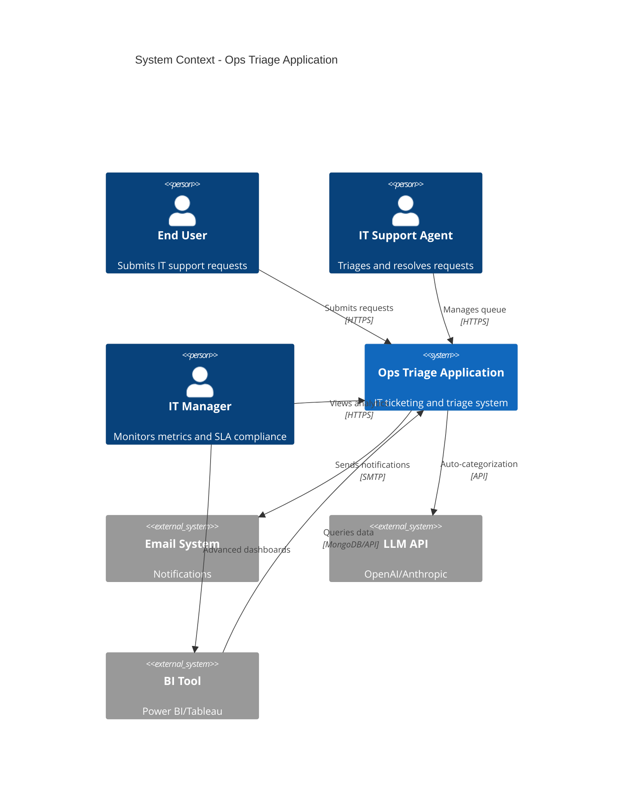
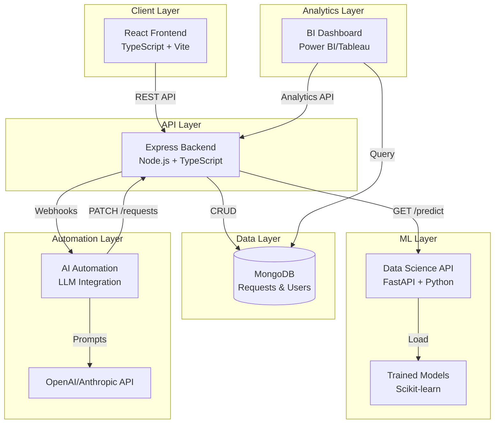
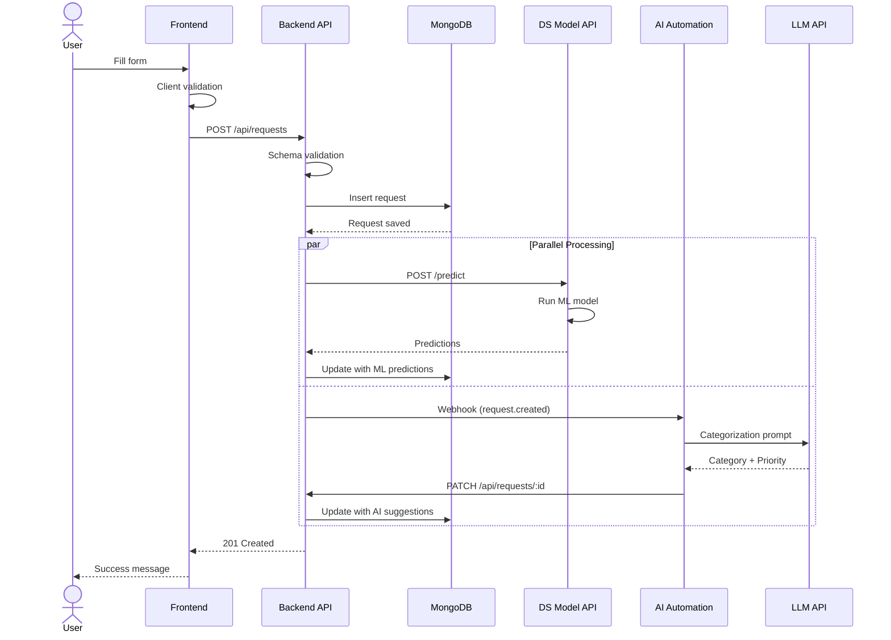
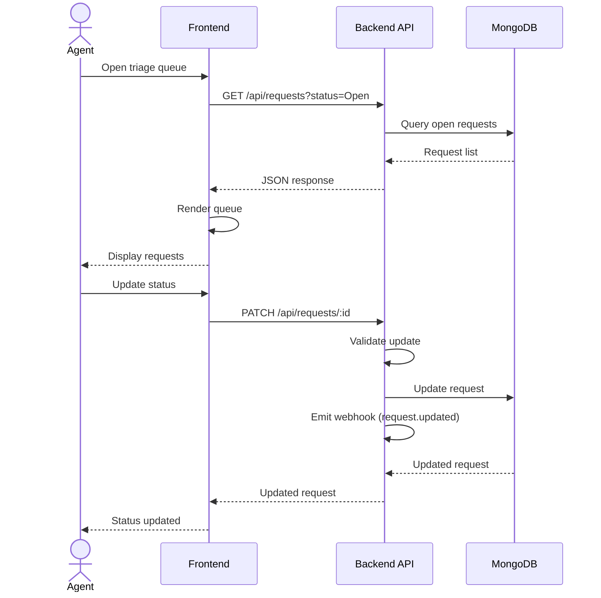
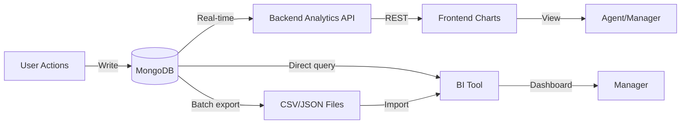
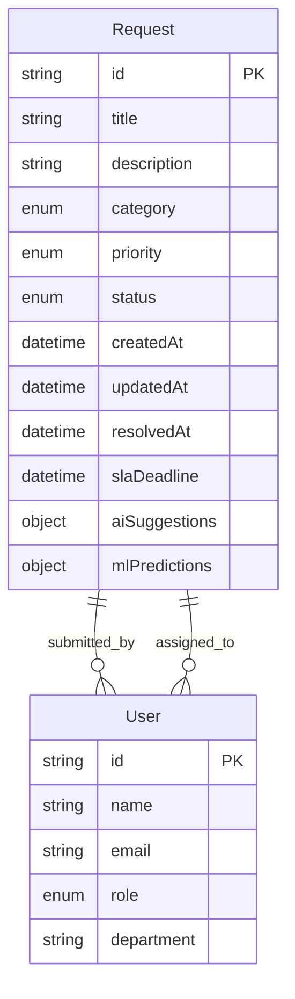
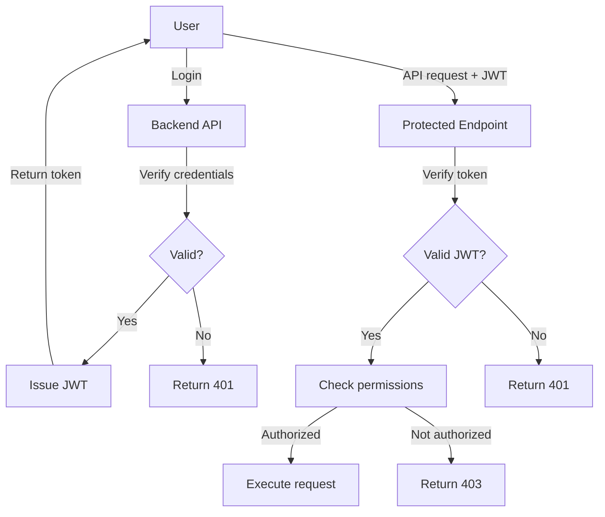
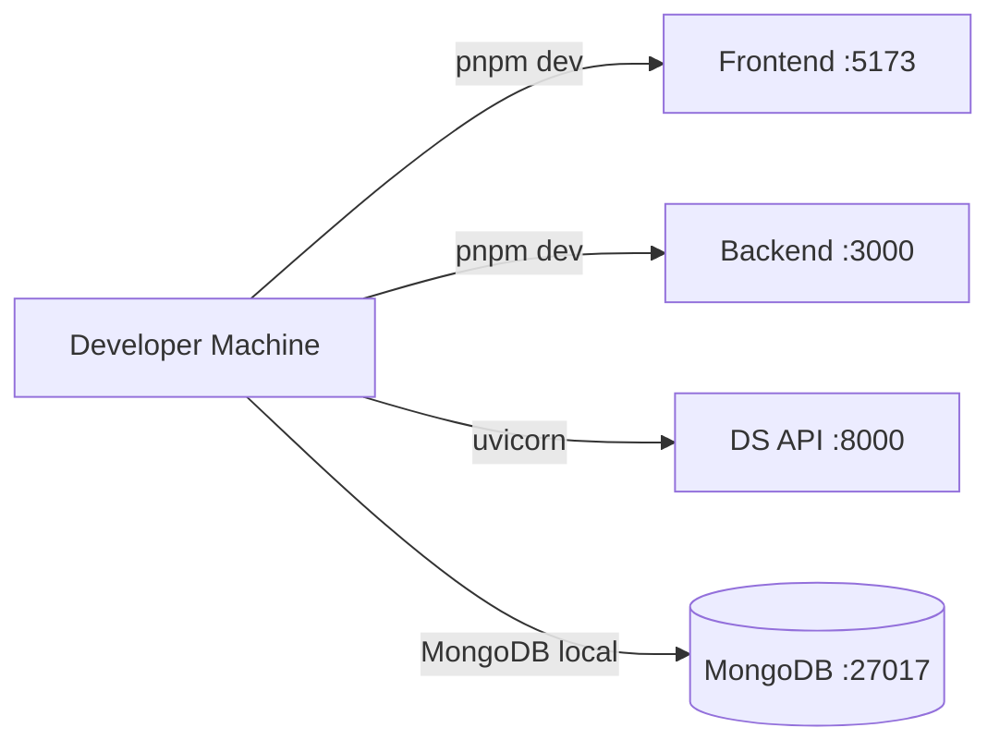
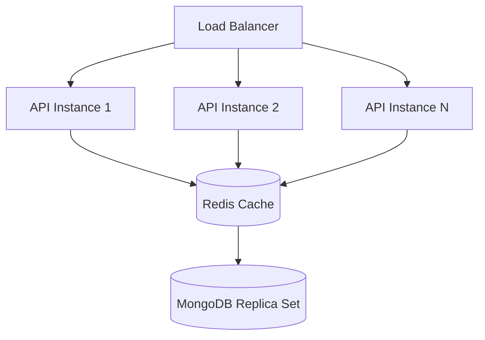

# System Architecture

This document describes the overall architecture of the Ops Triage Application, including system context, component design, data flow, and key technical decisions.

## 🎯 Architecture Overview

The Ops Triage Application is a **modern web application** built with a **microservices-inspired architecture**, featuring:
- Decoupled frontend and backend
- ML model as a separate service
- Event-driven AI automation
- External BI tools for analytics
- Modular, independently deployable components

## 🏗️ System Context Diagram



## 📦 Component Architecture



### Component Responsibilities

| Component | Technology | Purpose | Deployed |
|-----------|-----------|---------|----------|
| **Frontend** | React + TypeScript | User interface, forms, dashboards | Vercel/Netlify |
| **Backend API** | Express + Node.js | Business logic, API endpoints, webhooks | Heroku/Railway |
| **Database** | MongoDB | Persistent storage | MongoDB Atlas |
| **DS Model API** | FastAPI + Python | ML predictions for triage | Docker/Cloud Run |
| **AI Automation** | LLM + Custom code | Auto-categorization via prompts | Serverless/VPS |
| **BI Dashboard** | Power BI/Tableau | Advanced analytics | BI Cloud |

## 🔄 Data Flow Architecture

### Request Submission Flow



### Agent Triage Flow



### Analytics Data Flow



## 🗄️ Data Architecture

### Database Schema



### Data Models

**Request Schema**:
```typescript
interface Request {
  id: string;                    // UUID
  title: string;                 // 5-200 chars
  description: string;           // Max 2000 chars
  category: Category;            // Hardware|Software|Network|Access|Other
  priority: Priority;            // P0|P1|P2|P3
  status: Status;                // Open|In Progress|Resolved|Closed
  submittedBy: User;
  assignedTo: User | null;
  createdAt: Date;
  updatedAt: Date;
  resolvedAt: Date | null;
  slaDeadline: Date;
  aiSuggestions?: {
    category: string;
    priority: string;
    confidence: number;
    reasoning: string;
  };
  mlPredictions?: {
    category: string;
    categoryConfidence: number;
    priority: string;
    priorityConfidence: number;
  };
}
```

**User Schema**:
```typescript
interface User {
  id: string;                    // UUID
  name: string;
  email: string;
  role: 'Agent' | 'Manager' | 'User';
  department: string;
  createdAt: Date;
}
```

### Data Storage Strategy

| Data Type | Storage | Retention | Backup |
|-----------|---------|-----------|---------|
| **Requests** | MongoDB | Indefinite | Daily automated |
| **Users** | MongoDB | Indefinite | Daily automated |
| **ML Models** | File system | Latest + previous 3 | Version controlled |
| **Logs** | File/Cloud logging | 90 days | Not backed up |
| **Analytics** | Computed on-demand | N/A | Source data backed up |

## 🌐 API Architecture

### RESTful API Design

**Base URL**: `https://api.opstriage.com` (example)

**Versioning**: URL-based (`/api/v1/...`)

### API Endpoints

```yaml
# Request Management
GET    /api/requests              # List requests (with filters)
POST   /api/requests              # Create request
GET    /api/requests/:id          # Get single request
PATCH  /api/requests/:id          # Update request
DELETE /api/requests/:id          # Delete request (optional)

# Triage
POST   /api/triage                # Trigger auto-triage
POST   /api/triage/bulk           # Bulk triage

# Users
GET    /api/users                 # List users
GET    /api/users/:id             # Get user
POST   /api/users                 # Create user

# Analytics
GET    /api/analytics/summary     # High-level metrics
GET    /api/analytics/sla         # SLA compliance
GET    /api/analytics/categories  # Category breakdown
GET    /api/analytics/agents      # Agent performance

# Webhooks
POST   /api/webhooks/subscribe    # Subscribe to events
DELETE /api/webhooks/:id          # Unsubscribe

# Health
GET    /api/health                # Health check
GET    /api/version               # API version
```

### Response Format

**Success Response**:
```json
{
  "success": true,
  "data": { ... },
  "meta": {
    "timestamp": "2026-02-05T00:00:00Z",
    "version": "1.0.0"
  }
}
```

**Error Response**:
```json
{
  "success": false,
  "error": {
    "code": "VALIDATION_ERROR",
    "message": "Title must be at least 5 characters",
    "field": "title"
  },
  "meta": {
    "timestamp": "2026-02-05T00:00:00Z"
  }
}
```

## 🔐 Security Architecture

### Authentication & Authorization



### Security Layers

| Layer | Security Measures |
|-------|-------------------|
| **Transport** | HTTPS/TLS 1.3, HSTS headers |
| **Authentication** | JWT tokens, bcrypt password hashing |
| **Authorization** | Role-based access control (RBAC) |
| **Input Validation** | Schema validation, sanitization, parameterized queries |
| **API Security** | Rate limiting, CORS, API keys for service-to-service |
| **Data Protection** | Encryption at rest, PII handling, audit logs |
| **Infrastructure** | Firewall rules, environment variables, security headers |

### Threat Mitigation

See [`security/threat-model/STRIDE-analysis.md`](../packages/security/threat-model/STRIDE-analysis.md) for comprehensive threat analysis.

**Key mitigations**:
- **SQL Injection**: Mongoose ODM with parameterized queries
- **XSS**: React auto-escaping, Content Security Policy
- **CSRF**: SameSite cookies, CSRF tokens
- **DoS**: Rate limiting (100 req/15min per IP)
- **Data Breach**: Encryption, access controls, audit logging

## 🚀 Deployment Architecture

### Development Environment



### Production Environment

```mermaid
graph TB
    subgraph "CDN"
        CDN[Vercel/Netlify]
    end
    
    subgraph "Application Tier"
        LB[Load Balancer]
        API1[Backend Instance 1]
        API2[Backend Instance 2]
    end
    
    subgraph "ML Tier"
        DS[DS API Container]
    end
    
    subgraph "Data Tier"
        DB[(MongoDB Atlas<br/>Replica Set)]
    end
    
    subgraph "Automation"
        AI[AI Service]
    end
    
    Users -->|HTTPS| CDN
    CDN -->|Static assets| Users
    CDN -->|API proxy| LB
    LB --> API1
    LB --> API2
    API1 --> DB
    API2 --> DB
    API1 -->|ML predictions| DS
    API2 -->|ML predictions| DS
    API1 -->|Webhooks| AI
    API2 -->|Webhooks| AI
```

### Deployment Strategy

| Component | Platform | Scaling | Cost |
|-----------|----------|---------|------|
| **Frontend** | Vercel/Netlify | Auto (CDN) | Free tier |
| **Backend** | Railway/Heroku | Horizontal (2-5 instances) | $7-25/mo |
| **Database** | MongoDB Atlas | Auto (M0 cluster) | Free tier |
| **DS API** | Google Cloud Run | Auto (0-10 instances) | Pay-per-use |
| **AI Automation** | Vercel Functions | Auto | Pay-per-invocation |

## 🔧 Technology Stack

### Frontend Stack

```yaml
Core:
  - React 18
  - TypeScript 5
  - Vite (build tool)

UI/Styling:
  - CSS Modules / Tailwind CSS
  - Optional: Material-UI, Chakra UI

State Management:
  - React hooks (useState, useEffect)
  - Optional: Zustand, Redux Toolkit

HTTP Client:
  - Fetch API
  - Optional: Axios

Routing:
  - React Router v6
```

### Backend Stack

```yaml
Core:
  - Node.js 18+
  - Express.js
  - TypeScript 5

Database:
  - MongoDB 6+
  - Mongoose ODM

Validation:
  - Ajv (JSON Schema)
  - express-validator

Security:
  - Helmet.js
  - cors
  - bcrypt
  - jsonwebtoken

Testing:
  - Jest
  - Supertest
```

### Data Science Stack

```yaml
Core:
  - Python 3.9+
  - Jupyter Notebook

ML/Data:
  - pandas
  - numpy
  - scikit-learn
  - matplotlib, seaborn

API:
  - FastAPI
  - uvicorn
  - pydantic

Deployment:
  - Docker
  - gunicorn
```

### DevOps & Tools

```yaml
Version Control:
  - Git
  - GitHub

Package Management:
  - pnpm (monorepo)
  - pip (Python)

CI/CD:
  - GitHub Actions
  - Optional: Jenkins, CircleCI

Containerization:
  - Docker
  - Docker Compose

Monitoring:
  - Optional: Sentry (errors)
  - Optional: Datadog (metrics)
```

## 📊 Performance Considerations

### Performance Targets

| Metric | Target | Measurement |
|--------|--------|-------------|
| **Page Load** | < 2s | First Contentful Paint |
| **API Response** | < 500ms | 95th percentile |
| **ML Prediction** | < 2s | End-to-end |
| **Database Query** | < 100ms | Average |
| **Concurrent Users** | 100+ | Load testing |

### Optimization Strategies

**Frontend**:
- Code splitting (React.lazy)
- Image optimization
- Caching with service workers
- Lazy loading of components

**Backend**:
- Database indexing (category, status, createdAt)
- Query optimization
- Response caching (Redis optional)
- Pagination for large result sets

**Database**:
```javascript
// Indexes for common queries
db.requests.createIndex({ status: 1, createdAt: -1 });
db.requests.createIndex({ category: 1 });
db.requests.createIndex({ assignedTo: 1, status: 1 });
```

**ML API**:
- Model caching in memory
- Batch prediction support
- Async processing for non-critical paths

## 🔄 Scalability

### Horizontal Scaling



**Stateless backend**: Each API instance can handle any request
**Database replication**: Read replicas for analytics queries
**Caching layer**: Reduce database load for frequent queries

### Vertical Scaling Limits

- **Small**: 1 CPU, 512MB RAM - Development
- **Medium**: 2 CPU, 2GB RAM - Production (< 1000 users)
- **Large**: 4 CPU, 8GB RAM - Production (< 10000 users)

## 🎯 Design Decisions & Rationale

### Why MongoDB over SQL?

**Pros**:
- Flexible schema (request fields may evolve)
- JSON-native (matches API responses)
- Easy to get started
- Good free tier (Atlas)

**Cons**:
- No ACID guarantees (acceptable for this use case)
- Less standardized than SQL

**Decision**: MongoDB is acceptable for this project's scope.

### Why Separate DS API?

**Pros**:
- Different runtime (Python vs. Node.js)
- Independent scaling
- Isolate ML dependencies
- Easier to version models

**Cons**:
- More deployment complexity
- Network latency

**Decision**: Worth it for production-grade ML serving.

### Why Event-Driven for AI?

**Pros**:
- Async processing (don't block request creation)
- Decoupled (AI service can be down)
- Scalable (many subscribers possible)

**Cons**:
- More complex than direct calls
- Eventual consistency

**Decision**: Webhooks provide good balance of simplicity and decoupling.

### Why Monorepo?

**Pros**:
- Shared contracts and types
- Easier onboarding
- Coordinated changes
- Single repository

**Cons**:
- Larger repo size
- Build complexity

**Decision**: pnpm workspaces make monorepo manageable and beneficial.

## 📚 Related Documentation

- **[Integration Guide](./INTEGRATION.md)** - How components connect
- **[Contracts](./CONTRACTS.md)** - API and data contracts
- **[Security Docs](../packages/security/)** - Security architecture details
- **[Backend Architecture](../packages/backend/docs/ARCHITECTURE.md)** - Backend-specific design
- **[Frontend Architecture](../packages/frontend/docs/ARCHITECTURE.md)** - Frontend-specific design

## 🔮 Future Enhancements

**Potential improvements** (beyond MVP):

1. **Real-time Updates**: WebSockets for live queue updates
2. **Microservices**: Split backend into smaller services
3. **Message Queue**: RabbitMQ/Kafka for reliable event processing
4. **Advanced Auth**: OAuth2, SSO integration
5. **Mobile App**: React Native companion app
6. **Advanced ML**: Neural networks, BERT embeddings
7. **Observability**: Full logging, tracing, metrics stack
8. **Multi-tenancy**: Support multiple organizations

---

**This architecture balances**:
- ✅ Learning value (modern practices)
- ✅ Feasibility (achievable in semester)
- ✅ Real-world relevance (production patterns)
- ✅ Flexibility (adapt to team size/skills)
