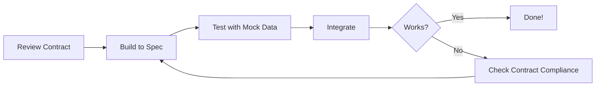

# Contracts Guide

## 🤝 What Are Contracts?

**Contracts** are formal agreements between different parts of the system and different team disciplines. They define:

- **Data structures**: What fields exist and their types
- **APIs**: How services communicate
- **Events**: What happens when actions occur
- **Business rules**: How the system should behave

Contracts enable **parallel development**—each team can work independently as long as they respect the shared contracts.

## 🎯 Why Contracts Matter

### Benefits

1. **Independence**: Teams don't block each other
2. **Clarity**: No ambiguity about data formats or APIs
3. **Testing**: Use mock data that conforms to contracts
4. **Integration**: Components "just work" if they follow contracts
5. **Documentation**: Contracts are living documentation

### The Contract-Based Workflow



---

## 📚 Contract Types & Locations

All contracts live in the [`contracts/`](../contracts/) directory:

```
contracts/
├── schemas/                    # Data format specifications
├── data-models/                # Business rules & definitions
├── integration-points/         # Cross-discipline contracts
├── user-stories/               # Functional requirements
└── mock-data/                  # Sample data for testing
```

### 1. Data Schema Contracts

**Location**: [`contracts/schemas/`](../contracts/schemas/)

These define the shape of data objects.

#### [`request.schema.json`](../contracts/schemas/request.schema.json)

The core data structure for IT support requests.

**Purpose**: Ensures all teams use the same request format

**Key Fields**:
```json
{
  "id": "string (UUID)",
  "title": "string (required)",
  "description": "string (required)",
  "category": "enum[Hardware, Software, Network, Access, Other]",
  "priority": "enum[P0, P1, P2, P3]",
  "status": "enum[Open, In Progress, Resolved, Closed]",
  "submittedBy": "User object",
  "assignedTo": "User object | null",
  "createdAt": "ISO 8601 timestamp",
  "resolvedAt": "ISO 8601 timestamp | null",
  "slaDeadline": "ISO 8601 timestamp"
}
```

**Who uses this**:
- **Frontend**: Display requests in UI
- **Backend**: Store/retrieve from database
- **Data Science**: Train models on historical requests
- **BIA**: Analyze request patterns
- **AI Automation**: Process requests for auto-triage

#### [`user.schema.json`](../contracts/schemas/user.schema.json)

User/agent data structure.

**Key Fields**:
```json
{
  "id": "string (UUID)",
  "name": "string",
  "email": "string (email format)",
  "role": "enum[Agent, Manager, User]",
  "department": "string"
}
```

#### [`api-contract.yml`](../contracts/schemas/api-contract.yml)

OpenAPI specification for the backend API.

**Purpose**: Defines all REST endpoints

**Key Endpoints**:
- `POST /api/requests` - Create new request
- `GET /api/requests` - List requests (with filters)
- `GET /api/requests/:id` - Get single request
- `PATCH /api/requests/:id` - Update request
- `POST /api/triage` - Trigger auto-triage
- `GET /api/analytics/*` - Analytics endpoints

**Who uses this**:
- **Frontend**: Make API calls
- **Backend**: Implement endpoints
- **QA**: Test API endpoints
- **AI Automation**: Subscribe to webhooks

#### [`event-contract.yml`](../contracts/schemas/event-contract.yml)

Defines webhook events emitted by the backend.

**Purpose**: Allow AI Automation to react to changes

**Events**:
- `request.created` - New request submitted
- `request.updated` - Request field changed
- `request.assigned` - Request assigned to agent
- `request.resolved` - Request marked resolved

### 2. Data Model Definitions

**Location**: [`contracts/data-models/`](../contracts/data-models/)

#### [`field-dictionary.md`](../contracts/data-models/field-dictionary.md)

Defines every field in the system with:
- Field name
- Data type
- Description
- Valid values
- Examples

**Example Entry**:
| Field | Type | Description | Valid Values |
|-------|------|-------------|--------------|
| `priority` | enum | Urgency level following SLA policy | P0, P1, P2, P3 |

#### [`priority-definitions.md`](../contracts/data-models/priority-definitions.md)

Business rules for priority levels:

| Priority | SLA | Description | Examples |
|----------|-----|-------------|----------|
| **P0** | 4 hours | Critical business impact | Full system outage |
| **P1** | 24 hours | Major feature broken | Email not working |
| **P2** | 3 days | Minor issue | Slow performance |
| **P3** | 5 days | Enhancement request | UI improvement |

**Who uses this**:
- **Data Science**: Label training data correctly
- **AI Automation**: Assign priorities via LLM
- **BIA**: Calculate SLA compliance
- **UX**: Display priorities in UI

#### [`request-lifecycle.md`](../contracts/data-models/request-lifecycle.md)

Defines valid status transitions:

```
Open → In Progress → Resolved → Closed
  ↓         ↓            ↓
  └─────────┴────────────┴──→ (Can reopen)
```

#### [`business-rules.md`](../contracts/data-models/business-rules.md)

System-wide business logic:
- SLA calculation formula
- Auto-assignment rules
- Validation rules
- Escalation policies

### 3. Integration Point Contracts

**Location**: [`contracts/integration-points/`](../contracts/integration-points/)

These define how different disciplines exchange data.

#### [`ds-model-output.schema.json`](../contracts/integration-points/ds-model-output.schema.json)

**Purpose**: Data Science model output format for triage predictions

**Format**:
```json
{
  "requestId": "uuid",
  "predictions": {
    "category": "Software",
    "categoryConfidence": 0.89,
    "priority": "P2",
    "priorityConfidence": 0.76,
    "suggestedAgent": "uuid | null",
    "estimatedResolutionTime": 48
  },
  "modelVersion": "1.0.0",
  "timestamp": "ISO 8601"
}
```

**Who uses this**:
- **Data Science**: Return predictions in this format
- **Backend**: Consume predictions from DS API
- **AI Automation**: May use as secondary input

#### [`ai-automation-input.schema.json`](../contracts/integration-points/ai-automation-input.schema.json)

**Purpose**: Data sent to AI Automation workflows

**Format**:
```json
{
  "request": { /* full request object */ },
  "context": {
    "queueDepth": 15,
    "agentAvailability": [...],
    "recentSimilar": [...]
  }
}
```

#### [`webhook-events.schema.json`](../contracts/integration-points/webhook-events.schema.json)

**Purpose**: Event payloads sent to webhook subscribers

**Format**:
```json
{
  "eventType": "request.created",
  "timestamp": "ISO 8601",
  "payload": { /* relevant data */ },
  "metadata": {
    "source": "backend-api",
    "version": "1.0"
  }
}
```

### 4. User Stories

**Location**: [`contracts/user-stories/`](../contracts/user-stories/)

Functional requirements written from user perspective.

- [`US-01-submit-request.md`](../contracts/user-stories/US-01-submit-request.md) - End users submit tickets
- [`US-02-agent-triage.md`](../contracts/user-stories/US-02-agent-triage.md) - Agents manage queue
- [`US-03-manager-dashboard.md`](../contracts/user-stories/US-03-manager-dashboard.md) - Managers view insights

**Format**:
```
As a [persona]
I want to [action]
So that [benefit]

Acceptance Criteria:
- [ ] Criterion 1
- [ ] Criterion 2
```

**Who uses this**:
- **All disciplines** - Understand requirements
- **UX**: Inform user flows
- **SE**: Implement features
- **QA**: Write test cases

### 5. Mock Data

**Location**: [`contracts/mock-data/`](../contracts/mock-data/)

Sample data for development and testing.

- [`requests.json`](../contracts/mock-data/requests.json) - 100+ sample requests
- [`users.json`](../contracts/mock-data/users.json) - Sample users and agents
- [`requests.csv`](../contracts/mock-data/requests.csv) - CSV format for BI tools
- [`data-generator.js`](../contracts/mock-data/data-generator.js) - Generate more data

**Who uses this**:
- **Frontend**: Develop UI without backend
- **Backend**: Seed database for testing
- **Data Science**: Train initial models
- **BIA**: Practice dashboard creation
- **QA**: Test data validation

---

## 📖 How to Read Contracts

### JSON Schema Example

```json
{
  "type": "object",
  "required": ["title", "description"],
  "properties": {
    "title": {
      "type": "string",
      "minLength": 5,
      "maxLength": 200
    },
    "priority": {
      "type": "string",
      "enum": ["P0", "P1", "P2", "P3"]
    }
  }
}
```

**Reading this**:
- Object must have `title` and `description`
- `title` is a string, 5-200 characters
- `priority` is optional, but if provided must be P0/P1/P2/P3

### OpenAPI Endpoint Example

```yaml
/api/requests:
  post:
    summary: Create a new request
    requestBody:
      required: true
      content:
        application/json:
          schema:
            $ref: '#/components/schemas/CreateRequestDTO'
    responses:
      201:
        description: Request created
        content:
          application/json:
            schema:
              $ref: '#/components/schemas/Request'
```

**Reading this**:
- `POST /api/requests` creates a request
- Body must be JSON matching CreateRequestDTO schema
- Returns 201 status with full Request object

---

## 🔧 How to Use Contracts

### For Frontend Developers

1. **Read API contract** to know endpoints
2. **Use request/user schemas** for TypeScript types
3. **Load mock data** for development
4. **Validate responses** match schemas

```typescript
// Generate types from schema
import { Request } from '@contracts/schemas/request.schema';

// Use in components
const request: Request = await api.getRequest(id);
```

### For Backend Developers

1. **Implement API contract** exactly as specified
2. **Validate inputs** against schemas
3. **Emit webhook events** per event contract
4. **Return data** matching schemas

```typescript
// Use schema for validation
import Ajv from 'ajv';
import requestSchema from '@contracts/schemas/request.schema.json';

const ajv = new Ajv();
const validate = ajv.compile(requestSchema);
const isValid = validate(data);
```

### For Data Scientists

1. **Load mock data** to understand structure
2. **Output predictions** matching DS integration contract
3. **Follow priority definitions** for labeling
4. **Document model** using contract terminology

```python
# Return predictions matching contract
def predict(request_data):
    return {
        "requestId": request_data["id"],
        "predictions": {
            "category": predicted_category,
            "categoryConfidence": confidence,
            ...
        },
        "modelVersion": "1.0.0",
        "timestamp": datetime.now().isoformat()
    }
```

### For BIA

1. **Use CSV mock data** in your BI tool
2. **Understand field dictionary** for column meanings
3. **Calculate metrics** per business rules
4. **Reference priority definitions** for SLA buckets

### For AI Automation

1. **Subscribe to webhook events** per event contract
2. **Receive request data** matching schema
3. **Return structured outputs** (category, priority)
4. **Follow guardrails** in prompts directory

### For QA

1. **Test against API contract** endpoints
2. **Validate data** matches schemas
3. **Use user stories** to write test cases
4. **Test with mock data** and edge cases

---

## 🛠️ Proposing Contract Changes

Contracts should be **stable**, but if you discover an issue:

### Process

1. **Document the issue**: Why does the contract need to change?
2. **Assess impact**: Which teams are affected?
3. **Propose solution**: What should the new contract be?
4. **Get consensus**: All affected teams must agree
5. **Update contracts**: Make changes in `contracts/` directory
6. **Notify all teams**: Announce the change
7. **Update implementations**: All teams adapt their code

### Example Change Request

```markdown
## Contract Change Proposal

**Contract**: request.schema.json
**Proposed by**: Software Engineering
**Date**: 2026-02-05

**Issue**: Unable to track request urgency separately from SLA priority

**Proposed Change**: Add optional `urgency` field
{
  "urgency": {
    "type": "string",
    "enum": ["Low", "Medium", "High", "Critical"]
  }
}

**Impact**:
- Frontend: Update UI to show urgency
- Backend: Add field to model
- Data Science: May improve predictions
- BIA: New dimension for analysis

**Status**: Awaiting team approval
```

---

## ✅ Contract Validation

### Automated Validation

```bash
# Validate all contracts
npm run validate:contracts

# Validate specific schema
npm run validate:schema contracts/schemas/request.schema.json
```

### Manual Validation

Use online tools:
- **JSON Schema**: [jsonschemavalidator.net](https://www.jsonschemavalidator.net/)
- **OpenAPI**: [editor.swagger.io](https://editor.swagger.io/)

### In Your Code

```typescript
// Backend: Validate incoming request
import { validateRequest } from '@shared/validators';

const errors = validateRequest(data);
if (errors.length > 0) {
  return res.status(400).json({ errors });
}
```

---

## 🎯 Best Practices

1. **Trust the contracts**: If it matches the contract, it's correct
2. **Don't assume**: If it's not in the contract, don't rely on it
3. **Validate early**: Check contract compliance during development
4. **Use mock data**: Don't wait for other teams
5. **Communicate changes**: Never silently change a contract
6. **Version APIs**: If you must break compatibility, version the API
7. **Document deviations**: If you can't follow a contract, document why

---

## 📚 Related Documentation

- **[Integration Guide](./INTEGRATION.md)** - How to integrate across disciplines
- **[Architecture](./ARCHITECTURE.md)** - System design overview
- **[Backend API Docs](../packages/backend/docs/API.md)** - Detailed endpoint documentation
- **[Data Science Integration](../packages/data-science/docs/INTEGRATION.md)** - DS model integration

---

## ❓ FAQ

**Q: Can I add extra fields to my implementation?**  
A: Yes, but don't require them from other teams. Stick to the contract for shared data.

**Q: What if a contract is wrong or missing something?**  
A: Propose a change using the process above. Get team agreement first.

**Q: How do I know if my data matches the contract?**  
A: Use the validation scripts or schema validators in your code.

**Q: Can I ignore contracts for rapid prototyping?**  
A: No. Contracts enable parallel work. Ignoring them causes integration pain later.

---

**Remember**: Contracts are your team's shared foundation. Respect them, and your integration will be smooth! 🤝
