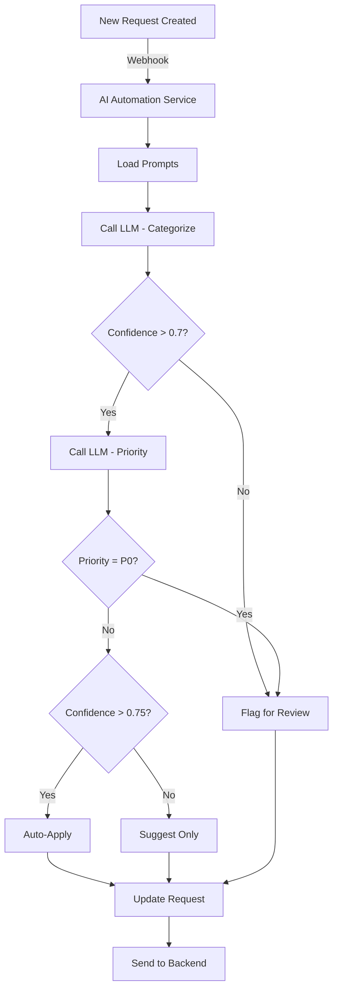

# AI Automation Discipline Guide

## 🎯 Role Overview

As an **AI Automation** specialist, you leverage Large Language Models (LLMs) to automate the triage process. You'll design prompts, create workflows, and ensure AI suggestions are accurate, safe, and valuable.

### Your Impact

- **Agents save time** with AI-powered categorization
- **Users get faster responses** through automation
- **The system scales** with intelligent assistance
- **Quality improves** with well-designed prompts

## 📋 Required Deliverables

| Deliverable | Location | Description |
|-------------|----------|-------------|
| **Category Prompt** | [`packages/ai-automation/prompts/categorize-request.txt`](../../packages/ai-automation/prompts/categorize-request.txt) | LLM prompt for categorization |
| **Priority Prompt** | [`packages/ai-automation/prompts/assign-priority.txt`](../../packages/ai-automation/prompts/assign-priority.txt) | LLM prompt for priority assignment |
| **Summary Prompt** | [`packages/ai-automation/prompts/summarize-request.txt`](../../packages/ai-automation/prompts/summarize-request.txt) | Request summarization prompt |
| **Guardrails** | [`packages/ai-automation/prompts/guardrails.md`](../../packages/ai-automation/prompts/guardrails.md) | Safety and validation rules |
| **Workflow** | [`packages/ai-automation/workflows/`](../../packages/ai-automation/workflows/) | Automation workflow design |
| **Integration Doc** | [`packages/ai-automation/docs/INTEGRATION.md`](../../packages/ai-automation/docs/INTEGRATION.md) | How to integrate with backend |

## 🛠️ Tools & Technologies

### LLM Providers (Choose ONE)

**Option 1: OpenAI** (Recommended)
- Models: GPT-4, GPT-3.5-turbo
- Pricing: ~$0.03 per 1K tokens (GPT-4)
- Sign up: [platform.openai.com](https://platform.openai.com)
- Free trial: $5 credit

**Option 2: Anthropic**
- Models: Claude 3 Opus, Sonnet, Haiku
- Pricing: Similar to OpenAI
- Sign up: [console.anthropic.com](https://console.anthropic.com)

**Option 3: Local Models**
- Ollama (run LLMs locally)
- Models: Llama 2, Mistral
- Free but slower, less capable

### Automation Platforms (Optional)

**Option 1: Custom Code** (Recommended for learning)
- Node.js + OpenAI SDK
- Direct API calls
- Full control

**Option 2: n8n** (Low-code)
- Visual workflow builder
- Pre-built LLM nodes
- Self-hosted or cloud

**Option 3: Zapier/Make**
- No-code automation
- Limited customization
- Good for prototyping

## 🚀 Setup Instructions

### 1. Get API Keys

**OpenAI**:
1. Create account at [platform.openai.com/signup](https://platform.openai.com/signup)
2. Go to API Keys
3. Create new key
4. Copy key (starts with `sk-...`)

**Anthropic**:
1. Create account at [console.anthropic.com](https://console.anthropic.com)
2. Get API key
3. Copy key

### 2. Configure Environment

```bash
cd packages/ai-automation

# Create .env file
cat > .env << EOF
OPENAI_API_KEY=sk-your-key-here
# OR
ANTHROPIC_API_KEY=your-key-here

BACKEND_API_URL=http://localhost:3000
CONFIDENCE_THRESHOLD=0.7
EOF
```

### 3. Install Dependencies

```bash
pnpm install
# Installs: openai, anthropic, dotenv, express
```

### 4. Test LLM Connection

```typescript
// test-llm.ts
import OpenAI from 'openai';

const openai = new OpenAI({
  apiKey: process.env.OPENAI_API_KEY
});

async function test() {
  const response = await openai.chat.completions.create({
    model: 'gpt-3.5-turbo',
    messages: [
      { role: 'user', content: 'Say hello!' }
    ]
  });
  
  console.log(response.choices[0].message.content);
}

test();
```

Run: `npx tsx test-llm.ts`

## 📝 Prompt Engineering

### Categorization Prompt

**File**: [`prompts/categorize-request.txt`](../../packages/ai-automation/prompts/categorize-request.txt)

```
You are an IT support classification assistant. Your task is to categorize IT support requests into exactly one of these categories:

CATEGORIES:
- Hardware: Physical devices (laptops, monitors, keyboards, printers, phones)
- Software: Applications, operating systems, software licenses
- Network: Internet, WiFi, VPN, connectivity issues
- Access: Passwords, permissions, account access, authentication
- Other: Anything that doesn't fit the above

INSTRUCTIONS:
1. Read the request title and description carefully
2. Identify the primary issue
3. Choose the most appropriate category
4. Provide a confidence score (0-1)
5. Explain your reasoning briefly

EXAMPLES:

Request: "My laptop screen is cracked"
Category: Hardware
Confidence: 0.95
Reasoning: Physical damage to a device

Request: "Can't login to email"
Category: Access
Confidence: 0.85
Reasoning: Authentication/login issue

Request: "Excel keeps crashing"
Category: Software
Confidence: 0.90
Reasoning: Application malfunction

Request: "WiFi not connecting in conference room"
Category: Network
Confidence: 0.90
Reasoning: Connectivity issue

NOW CATEGORIZE THIS REQUEST:

Title: {title}
Description: {description}

Respond in JSON:
{
  "category": "one of: Hardware, Software, Network, Access, Other",
  "confidence": 0.XX,
  "reasoning": "brief explanation"
}
```

### Priority Assignment Prompt

**File**: [`prompts/assign-priority.txt`](../../packages/ai-automation/prompts/assign-priority.txt)

```
You are an IT support priority assessment assistant. Assign priority levels based on business impact and urgency.

PRIORITY LEVELS (from SLA policy):

P0 - CRITICAL (4h SLA)
- Complete system outage affecting multiple users
- Critical business process stopped
- Security breach or data loss
- Examples: Email system down, all users can't login, ransomware detected

P1 - HIGH (24h SLA)
- Major functionality broken for multiple users
- Important business process impaired but workarounds exist
- Examples: Printer not working (shared), VPN issues (5+ users affected)

P2 - MEDIUM (3 day SLA)
- Minor issue affecting single user or small group
- Functionality reduced but not critical
- Examples: Software running slow, minor UI bug, single monitor issue

P3 - LOW (5 day SLA)
- Enhancement requests
- Questions or how-to requests
- Cosmetic issues
- Examples: "How do I change my signature?", feature request

ASSESSMENT CRITERIA:
1. How many users are affected?
2. Is there a workaround?
3. Is business-critical work blocked?
4. Is this urgent or can it wait?

EXAMPLES:

Request: "Cannot access any files on shared drive - 20 users affected"
Priority: P0
Confidence: 0.95
Reasoning: Multiple users, critical business files inaccessible, no workaround

Request: "My mouse is broken, using laptop trackpad for now"
Priority: P2
Confidence: 0.85
Reasoning: Single user, has workaround (trackpad), not critical

Request: "Can we add dark mode to the portal?"
Priority: P3
Confidence: 0.90
Reasoning: Enhancement request, not urgent

NOW ASSIGN PRIORITY:

Title: {title}
Description: {description}
Category: {category}

Respond in JSON:
{
  "priority": "P0, P1, P2, or P3",
  "confidence": 0.XX,
  "reasoning": "brief explanation",
  "estimatedImpact": "number of users or business impact"
}
```

### Summarization Prompt

**File**: [`prompts/summarize-request.txt`](../../packages/ai-automation/prompts/summarize-request.txt)

```
You are an IT support summarization assistant. Create concise, actionable summaries of support requests.

GUIDELINES:
- Keep summary to 1-2 sentences max
- Focus on the problem, not unnecessary details
- Use technical but clear language
- Preserve critical information (error messages, affected systems)

EXAMPLES:

Request: "Hi, I've been trying to access my email all morning but it keeps saying my password is wrong. I tried resetting it twice but the reset link never arrives. This is urgent because I'm expecting an important client email. Please help ASAP!!"

Summary: "User unable to access email due to password reset emails not being received."

Request: "Our team's shared printer in the 3rd floor conference room has been making weird noises and the prints are coming out with black streaks. We have an important client meeting this afternoon and need to print materials."

Summary: "Shared printer on 3rd floor producing poor quality prints with streaks; urgent for client meeting."

NOW SUMMARIZE:

Title: {title}
Description: {description}

Respond with just the summary (no JSON, just the text).
```

## 🤖 Implementation

### Basic Automation Service

```typescript
// packages/ai-automation/src/automation.ts
import OpenAI from 'openai';
import fs from 'fs';
import path from 'path';

const openai = new OpenAI({
  apiKey: process.env.OPENAI_API_KEY
});

// Load prompts
const categoryPrompt = fs.readFileSync(
  path.join(__dirname, '../prompts/categorize-request.txt'),
  'utf-8'
);
const priorityPrompt = fs.readFileSync(
  path.join(__dirname, '../prompts/assign-priority.txt'),
  'utf-8'
);

export async function categorizeRequest(title: string, description: string) {
  const prompt = categoryPrompt
    .replace('{title}', title)
    .replace('{description}', description);
  
  const response = await openai.chat.completions.create({
    model: 'gpt-3.5-turbo',
    messages: [{ role: 'user', content: prompt }],
    temperature: 0.3, // Lower = more consistent
    response_format: { type: 'json_object' }
  });
  
  const result = JSON.parse(response.choices[0].message.content!);
  return result;
}

export async function assignPriority(
  title: string, 
  description: string, 
  category: string
) {
  const prompt = priorityPrompt
    .replace('{title}', title)
    .replace('{description}', description)
    .replace('{category}', category);
  
  const response = await openai.chat.completions.create({
    model: 'gpt-3.5-turbo',
    messages: [{ role: 'user', content: prompt }],
    temperature: 0.3,
    response_format: { type: 'json_object' }
  });
  
  const result = JSON.parse(response.choices[0].message.content!);
  return result;
}

// Main automation function
export async function processRequest(request: any) {
  // 1. Categorize
  const categoryResult = await categorizeRequest(
    request.title,
    request.description
  );
  
  // 2. Assign priority
  const priorityResult = await assignPriority(
    request.title,
    request.description,
    categoryResult.category
  );
  
  // 3. Combine results
  return {
    category: categoryResult.category,
    categoryConfidence: categoryResult.confidence,
    priority: priorityResult.priority,
    priorityConfidence: priorityResult.confidence,
    reasoning: {
      category: categoryResult.reasoning,
      priority: priorityResult.reasoning
    }
  };
}
```

### Webhook Handler

```typescript
// packages/ai-automation/src/webhook-handler.ts
import express from 'express';
import { processRequest } from './automation';

const app = express();
app.use(express.json());

// Receive webhooks from backend
app.post('/webhooks/request-created', async (req, res) => {
  try {
    const { payload } = req.body;
    const request = payload;
    
    console.log(`Processing request: ${request.id}`);
    
    // Run AI automation
    const aiSuggestions = await processRequest(request);
    
    // Send back to backend
    await fetch(`${process.env.BACKEND_API_URL}/api/requests/${request.id}`, {
      method: 'PATCH',
      headers: { 'Content-Type': 'application/json' },
      body: JSON.stringify({
        aiSuggestions,
        category: aiSuggestions.category,
        priority: aiSuggestions.priority
      })
    });
    
    res.sendStatus(200);
  } catch (error) {
    console.error('Webhook processing failed:', error);
    res.sendStatus(500);
  }
});

app.listen(3001, () => {
  console.log('AI Automation webhook listener on http://localhost:3001');
});
```

## 🛡️ Guardrails & Validation

**File**: [`prompts/guardrails.md`](../../packages/ai-automation/prompts/guardrails.md)

```markdown
# AI Automation Guardrails

## Output Validation

### 1. Category Validation
- Must be one of: Hardware, Software, Network, Access, Other
- If LLM returns invalid category, default to "Other"
- Log unexpected categories for prompt refinement

### 2. Priority Validation
- Must be one of: P0, P1, P2, P3
- If LLM returns invalid priority, default to P3 (safest)
- Never auto-assign P0 without human review

### 3. Confidence Thresholds
- Minimum confidence: 0.5
- If confidence < 0.7, flag for human review
- High confidence (>0.9): Can auto-apply
- Low confidence (<0.7): Show as suggestion only

## Safety Rules

### 1. Never Fully Automate P0
- P0 suggestions require human approval
- Too risky to auto-assign critical priorities

### 2. Audit Trail
- Log all AI decisions
- Store prompts and responses
- Track accuracy over time

### 3. Fallback Strategy
- If API fails, use rule-based fallback
- If confidence too low, escalate to human
- Never block request submission on AI failure

### 4. Content Safety
- Check for offensive/inappropriate content
- Reject requests with PII in wrong fields
- Sanitize before sending to LLM

## Monitoring

- Track category accuracy: Target >85%
- Track priority accuracy: Target >80%
- Monitor API costs
- Alert on confidence drops
```

### Validation Code

```typescript
// packages/ai-automation/src/validators.ts
import { CATEGORIES, PRIORITIES } from './constants';

export function validateCategory(category: string): string {
  if (CATEGORIES.includes(category)) {
    return category;
  }
  console.warn(`Invalid category from LLM: ${category}, defaulting to Other`);
  return 'Other';
}

export function validatePriority(priority: string): string {
  if (PRIORITIES.includes(priority)) {
    return priority;
  }
  console.warn(`Invalid priority from LLM: ${priority}, defaulting to P3`);
  return 'P3';
}

export function checkConfidence(
  confidence: number,
  threshold: number = 0.7
): boolean {
  return confidence >= threshold;
}

export function shouldAutoApply(
  category: string,
  priority: string,
  categoryConfidence: number,
  priorityConfidence: number
): boolean {
  // Never auto-apply P0
  if (priority === 'P0') return false;
  
  // Both must meet confidence threshold
  const threshold = 0.75;
  return categoryConfidence >= threshold && priorityConfidence >= threshold;
}
```

## 📊 Workflow Design

Create workflow diagram in [`workflows/workflow-diagram.mmd`](../../packages/ai-automation/workflows/workflow-diagram.mmd):



## ✅ Deliverable Checklist

**Prompts**:
- [ ] Category prompt with examples
- [ ] Priority prompt with SLA references
- [ ] Summary prompt
- [ ] All prompts tested and achieve >80% accuracy

**Guardrails**:
- [ ] Validation rules documented
- [ ] Confidence thresholds defined
- [ ] Fallback strategies described
- [ ] Safety measures in place

**Implementation**:
- [ ] AI service runs and processes requests
- [ ] Webhook integration works
- [ ] Validation prevents invalid outputs
- [ ] Error handling in place

**Documentation**:
- [ ] Integration guide for backend team
- [ ] Setup instructions
- [ ] Workflow diagram
- [ ] Accuracy metrics documented

## 🎯 Stretch Goals

- [ ] **Chain-of-Thought**: Add reasoning steps to prompts
- [ ] **Few-Shot Learning**: Add more examples, update based on real data
- [ ] **Multi-Step Workflow**: n8n visual workflow
- [ ] **Feedback Loop**: Learn from human corrections
- [ ] **Advanced Prompting**: Self-consistency, tree-of-thought
- [ ] **Agent Recommendation**: Suggest best agent based on expertise
- [ ] **Batch Processing**: Process multiple requests efficiently
- [ ] **Cost Optimization**: Use cheaper models for simple cases

## 📚 Resources

- **OpenAI Docs**: [platform.openai.com/docs](https://platform.openai.com/docs)
- **Prompt Engineering Guide**: [promptingguide.ai](https://www.promptingguide.ai/)
- **Learn Prompting**: [learnprompting.org](https://learnprompting.org/)
- **Anthropic Prompting**: [docs.anthropic.com/prompting](https://docs.anthropic.com/claude/docs/introduction-to-prompt-design)

---

**Harness the power of AI responsibly!** 🤖✨
