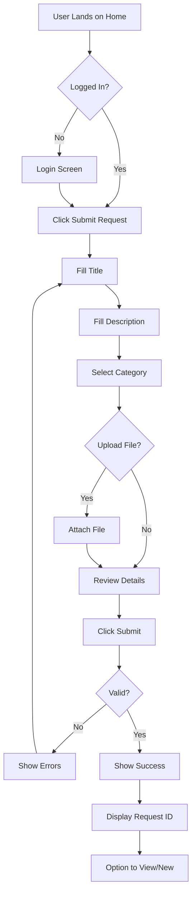

# UX/UI Design Discipline Guide

## 🎯 Role Overview

As a **UX/UI Designer**, you are the voice of the user. Your work ensures the Ops Triage Application is intuitive, accessible, and delightful to use. You'll research user needs, design flows, create prototypes, and provide developers with everything they need to build a great experience.

### Your Impact

- **Users' first impression** depends on your design
- **Adoption success** relies on your understanding of user needs
- **Development efficiency** improves with your clear handoff documentation
- **Accessibility** ensures the app works for everyone

## 📋 Required Deliverables

| Deliverable | Location | Description |
|-------------|----------|-------------|
| **User Personas** | [`packages/ux-design/research/personas.md`](../../packages/ux-design/research/personas.md) | 2-3 detailed user personas |
| **Problem Framing** | [`packages/ux-design/research/problem-framing.md`](../../packages/ux-design/research/problem-framing.md) | User pain points and opportunities |
| **Success Metrics** | [`packages/ux-design/research/success-metrics.md`](../../packages/ux-design/research/success-metrics.md) | How to measure UX success |
| **User Flows** | [`packages/ux-design/user-flows/`](../../packages/ux-design/user-flows/) | Mermaid diagrams for all 3 core flows |
| **Design System** | [`packages/ux-design/design-system/`](../../packages/ux-design/design-system/) | Colors, typography, components, tokens |
| **Prototype** | [`packages/ux-design/prototypes/figma-link.md`](../../packages/ux-design/prototypes/figma-link.md) | High-fidelity Figma prototype |
| **Accessibility** | [`packages/ux-design/accessibility/a11y-guidelines.md`](../../packages/ux-design/accessibility/a11y-guidelines.md) | WCAG 2.1 AA compliance plan |
| **Developer Handoff** | [`packages/ux-design/handoff/dev-handoff.md`](../../packages/ux-design/handoff/dev-handoff.md) | Component specs and assets |

## 🛠️ Tools & Technologies

### Design Tools

**Required**:
- **Figma** (primary design tool) - [figma.com](https://figma.com)
- **Mermaid** (flow diagrams) - [mermaid.live](https://mermaid.live)

**Optional**:
- Adobe XD, Sketch (alternatives to Figma)
- FigJam, Miro (collaboration)
- Optimal Workshop (user testing)
- UsabilityHub (feedback)

### Accessibility Tools

- **Color Contrast Checker**: [WebAIM Contrast Checker](https://webaim.org/resources/contrastchecker/)
- **WAVE**: Browser extension for accessibility evaluation
- **Axe DevTools**: Browser extension for a11y testing
- **Screen Reader**: NVDA (Windows), VoiceOver (Mac)

### Prototyping

- **Figma Prototyping**: Built-in interactive prototypes
- **Principle**: Animation tool (optional)
- **ProtoPie**: Advanced interactions (optional)

## 🚀 Setup Instructions

### 1. Set Up Figma

1. Create Figma account (free): [figma.com/signup](https://figma.com/signup)
2. Create new file: "Ops Triage Application"
3. Set up pages:
   - Research & Personas
   - User Flows
   - Wireframes
   - High-Fidelity Designs
   - Components
   - Prototypes

### 2. Install Browser Extensions

```bash
# For accessibility testing
- WAVE Evaluation Tool
- Axe DevTools
- Colorblindly (simulate color blindness)
```

### 3. Review Existing Materials

- **User Stories**: [`contracts/user-stories/`](../../contracts/user-stories/)
- **Data Models**: [`contracts/data-models/`](../../contracts/data-models/)
- **Existing Flows**: [`packages/ux-design/user-flows/`](../../packages/ux-design/user-flows/)

## 📖 Development Workflow

### Phase 1: Research & Discovery (Days 1-2)

**Goal**: Understand users and their needs

#### Step 1: Review User Stories

Read all user stories to understand:
- Who are the users?
- What are they trying to do?
- Why do they need this?

#### Step 2: Create Personas

**IT Support Agent Persona Example**:
```markdown
## Sarah - IT Support Agent

**Demographics**:
- Age: 28
- Role: Level 1 Support Agent
- Experience: 2 years in IT support

**Goals**:
- Resolve tickets quickly and accurately
- Meet SLA deadlines
- Reduce back-and-forth with users

**Pain Points**:
- Too many emails, hard to track
- Unclear priority on incoming tickets
- Manual categorization is time-consuming

**Needs**:
- Clear queue with priorities
- Quick access to ticket details
- Easy status updates
```

Create at least 3 personas:
1. IT Support Agent (primary)
2. IT Manager
3. End User

#### Step 3: Identify Pain Points

Document in [`research/pain-points.md`](../../packages/ux-design/research/pain-points.md):
- Current workflow problems
- Manual processes
- Information gaps
- Frustrations

#### Step 4: Define Success Metrics

Examples:
- Time to submit request: < 2 minutes
- Click depth to update status: ≤ 3 clicks
- Agent task completion rate: > 90%
- User satisfaction score: > 4/5

### Phase 2: Information Architecture (Days 2-3)

**Goal**: Define structure and flows

#### Step 5: Create User Flows

Use Mermaid to diagram each flow:

**Submit Request Flow** ([`user-flows/submit-request-flow.mmd`](../../packages/ux-design/user-flows/submit-request-flow.mmd)):


Create flows for:
1. Submit Request (US-01)
2. Agent Triage (US-02)
3. Manager Insights (US-03)

#### Step 6: Sitemap

```
Home
├── Submit Request (Intake)
├── My Requests (User View)
├── Triage Queue (Agent View)
│   └── Request Detail
│       ├── Edit Details
│       ├── Update Status
│       └── Assign Agent
└── Insights (Manager View)
    ├── Overview Dashboard
    ├── SLA Compliance
    └── Agent Performance
```

### Phase 3: Design System (Days 3-5)

**Goal**: Create consistent visual language

#### Step 7: Define Color Palette

Example color system ([`design-system/tokens.json`](../../packages/ux-design/design-system/tokens.json)):
```json
{
  "colors": {
    "primary": {
      "50": "#EEF2FF",
      "500": "#1E40AF",
      "700": "#1E3A8A"
    },
    "success": "#10B981",
    "warning": "#F59E0B",
    "error": "#EF4444",
    "neutral": {
      "50": "#F9FAFB",
      "100": "#F3F4F6",
      "500": "#6B7280",
      "900": "#111827"
    }
  },
  "priority": {
    "P0": "#DC2626",
    "P1": "#F59E0B",
    "P2": "#3B82F6",
    "P3": "#6B7280"
  },
  "status": {
    "open": "#3B82F6",
    "inProgress": "#F59E0B",
    "resolved": "#10B981",
    "closed": "#6B7280"
  }
}
```

**Requirements**:
- All colors meet WCAG AA contrast (4.5:1 for text)
- Color blind friendly (use patterns/icons too)

#### Step 8: Typography Scale

```json
{
  "typography": {
    "fontFamily": {
      "sans": "Inter, system-ui, sans-serif",
      "mono": "Fira Code, monospace"
    },
    "fontSize": {
      "xs": "12px",
      "sm": "14px",
      "base": "16px",
      "lg": "18px",
      "xl": "20px",
      "2xl": "24px",
      "3xl": "30px",
      "4xl": "36px"
    },
    "fontWeight": {
      "normal": "400",
      "medium": "500",
      "semibold": "600",
      "bold": "700"
    }
  }
}
```

#### Step 9: Spacing System

```json
{
  "spacing": {
    "xs": "4px",
    "sm": "8px",
    "md": "16px",
    "lg": "24px",
    "xl": "32px",
    "2xl": "48px",
    "3xl": "64px"
  }
}
```

#### Step 10: Component Specifications

Document each component in [`design-system/components.md`](../../packages/ux-design/design-system/components.md):

**Button Component**:
```markdown
## Button

### Variants
- **Primary**: Blue background, white text (main actions)
- **Secondary**: White background, blue border (secondary actions)
- **Danger**: Red background, white text (destructive actions)

### Sizes
- Small: 32px height, 12px 16px padding
- Medium: 40px height, 16px 24px padding
- Large: 48px height, 20px 32px padding

### States
- Default: Full opacity
- Hover: 80% opacity
- Active: 90% opacity
- Disabled: 50% opacity, cursor not-allowed
- Focus: 2px outline, 2px offset

### Accessibility
- Minimum 44x44px touch target
- Visible focus indicator
- Descriptive text (avoid "Click here")
```

### Phase 4: Wireframes & Prototypes (Days 5-6)

**Goal**: Create interactive prototype

#### Step 11: Low-Fidelity Wireframes

Start simple:
- Boxes and placeholders
- Focus on layout and hierarchy
- Get feedback early

#### Step 12: High-Fidelity Designs

In Figma:
1. Use design system components
2. Real content (not Lorem Ipsum)
3. All states (empty, loading, error, success)
4. Mobile and desktop views

**Required Screens**:
- Login (optional)
- Submit Request Form
- Triage Queue (table view)
- Request Detail Page
- Insights Dashboard

#### Step 13: Create Interactive Prototype

In Figma:
1. Connect screens with hotspots
2. Add transitions
3. Include micro-interactions
4. Test user flows end-to-end

**Share prototype link** in [`prototypes/figma-link.md`](../../packages/ux-design/prototypes/figma-link.md).

### Phase 5: Accessibility & Handoff (Days 6-7)

**Goal**: Ensure inclusive design and smooth developer handoff

#### Step 14: Accessibility Checklist

Document in [`accessibility/a11y-guidelines.md`](../../packages/ux-design/accessibility/a11y-guidelines.md):

- [ ] Color contrast ≥ 4.5:1 (text), ≥ 3:1 (UI components)
- [ ] Don't rely on color alone (use icons/patterns)
- [ ] All interactive elements ≥ 44x44px
- [ ] Keyboard navigation (Tab, Enter, Space, Esc)
- [ ] Focus indicators visible
- [ ] Form labels and errors
- [ ] Alt text for images
- [ ] ARIA labels for icons
- [ ] Semantic HTML planned
- [ ] Heading hierarchy (h1 → h2 → h3)

#### Step 15: Developer Handoff Document

Create [`handoff/dev-handoff.md`](../../packages/ux-design/handoff/dev-handoff.md):

**Include**:
1. **Component Inventory**: List all components with Figma links
2. **Spacing & Grid**: Layout specifications
3. **Responsive Breakpoints**:
   - Mobile: < 768px
   - Tablet: 768px - 1024px
   - Desktop: > 1024px
4. **Interaction States**: Hover, focus, active, disabled
5. **Animations**: Timing, easing, duration
6. **Asset Export**: Icons, logos, images

**Example**:
```markdown
## Request Card Component

**Figma**: [Link to component]

**Specs**:
- Width: 100% (responsive)
- Padding: 16px
- Border: 1px solid #E5E7EB
- Border radius: 8px
- Shadow: 0 1px 3px rgba(0,0,0,0.1)

**Content**:
- Title: font-size 18px, font-weight 600
- Description: font-size 14px, color #6B7280, max 2 lines
- Priority badge: Top right, colored by priority
- Category: Icon + label, font-size 12px

**States**:
- Default: As shown
- Hover: Shadow increases to 0 4px 6px rgba(0,0,0,0.1)
- Selected: 2px blue border

**Responsive**:
- Mobile: Stack vertically, full width
- Desktop: Grid, 3 columns
```

## 🎨 Design Best Practices

### Visual Hierarchy

1. **Size**: Most important elements largest
2. **Color**: Primary actions in brand color
3. **Position**: Top and left prioritized
4. **Spacing**: More space around important elements

### Consistency

- Use design system components
- Consistent spacing (8px grid)
- Same interaction patterns
- Predictable navigation

### Feedback

- Show loading states
- Confirm actions (especially destructive)
- Clear error messages
- Success states

### Forms

- Clear labels above fields
- Helpful placeholder text
- Inline validation
- Progress indicators for multi-step
- Disable submit until valid

## 🔌 Integration with Other Disciplines

### With Software Engineering

Provide:
- Design tokens (JSON)
- Component specifications
- Interaction details
- Assets (SVG icons, images)

Receive:
- Feedback on feasibility
- Implementation questions
- Edge cases to design

### With QA

Provide:
- User flows for test scenarios
- Expected interactions
- Accessibility requirements

Collaborate on:
- Usability testing
- A11y testing

## ✅ Deliverable Checklist

Before submission:

**Research**:
- [ ] 2-3 detailed personas
- [ ] Pain points documented
- [ ] Success metrics defined

**Flows**:
- [ ] All 3 user flows (Submit, Triage, Insights)
- [ ] Mermaid diagrams render correctly
- [ ] Decision points and error paths included

**Design System**:
- [ ] Color palette (with contrast checks)
- [ ] Typography scale
- [ ] Spacing system
- [ ] Component specifications
- [ ] Design tokens exported as JSON

**Prototype**:
- [ ] Figma link provided and accessible
- [ ] All core screens designed
- [ ] Interactive prototype working
- [ ] Mobile and desktop views
- [ ] All states designed (loading, error, empty)

**Accessibility**:
- [ ] WCAG 2.1 AA checklist completed
- [ ] Color contrast verified
- [ ] Keyboard navigation planned
- [ ] Focus indicators specified

**Handoff**:
- [ ] Component inventory
- [ ] Measurements and spacing
- [ ] Responsive breakpoints
- [ ] Assets exported
- [ ] Developer questions answered

## 🎯 Stretch Goals

- [ ] **Usability Testing**: Test with 3+ users, document findings
- [ ] **Advanced Interactions**: Micro-animations, loading states, transitions
- [ ] **Dark Mode**: Alternative color scheme
- [ ] **Internationalization**: Design for multiple languages
- [ ] **Advanced Accessibility**: WCAG AAA, screen reader testing
- [ ] **Design Documentation Site**: Storybook or similar
- [ ] **User Journey Map**: Detailed emotional journey
- [ ] **Competitive Analysis**: Compare with Zendesk, Jira Service Desk

## 📚 Additional Resources

### Design Inspiration

- **Dribbble**: [dribbble.com](https://dribbble.com) - Search "dashboard", "ticketing"
- **Mobbin**: [mobbin.com](https://mobbin.com) - Mobile design patterns
- **UI Movement**: [uimovement.com](https://uimovement.com)

### Accessibility

- **WCAG Guidelines**: [w3.org/WAI/WCAG21/quickref](https://www.w3.org/WAI/WCAG21/quickref/)
- **A11y Project**: [a11yproject.com](https://www.a11yproject.com/)
- **Inclusive Design**: [inclusive.microsoft.design](https://inclusive.microsoft.design/)

### Design Systems

- **Material Design**: [material.io](https://material.io)
- **Carbon Design**: [carbondesignsystem.com](https://www.carbondesignsystem.com/)
- **Atlassian Design**: [atlassian.design](https://atlassian.design/)

### Learning

- **Laws of UX**: [lawsofux.com](https://lawsofux.com/)
- **Refactoring UI**: [refactoringui.com](https://www.refactoringui.com/)
- **Figma Learn**: [help.figma.com](https://help.figma.com/)

## ❓ Common Questions

**Q: I'm not a designer. Can I still do this?**  
A: Yes! Use existing design systems (Material-UI, Ant Design) and focus on user flows and usability.

**Q: Do I need to design every single screen?**  
A: Focus on the 3 core user stories. Design key screens and document patterns for others.

**Q: What if Figma is too complex?**  
A: Start with wireframes in Excalidraw or even paper sketches. Focus on flows and usability.

**Q: How detailed should component specs be?**  
A: Enough for developers to implement. Include dimensions, colors, spacing, and states.

**Q: What if I can't do usability testing?**  
A: Test with classmates or friends. Even 2-3 users reveal most issues.

---

**Design with empathy, validate with users, deliver with clarity!** 🎨
