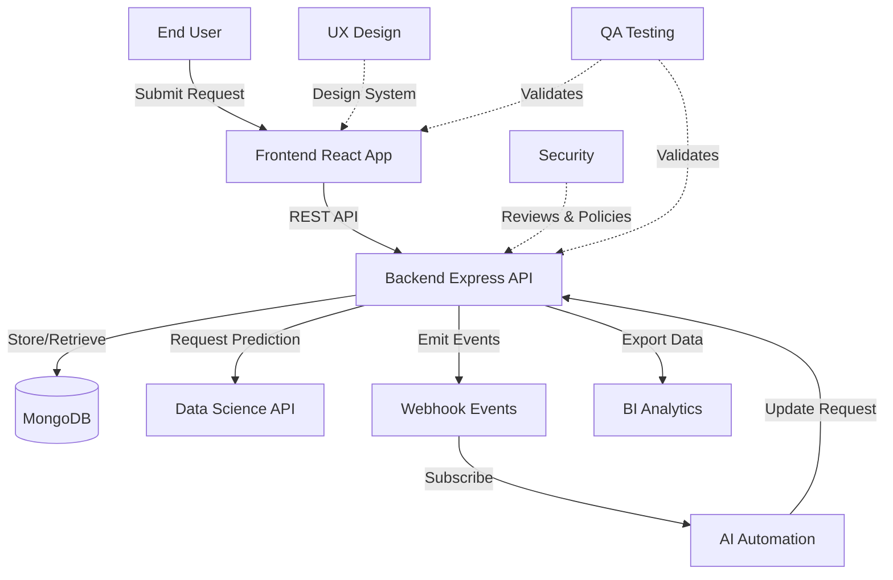
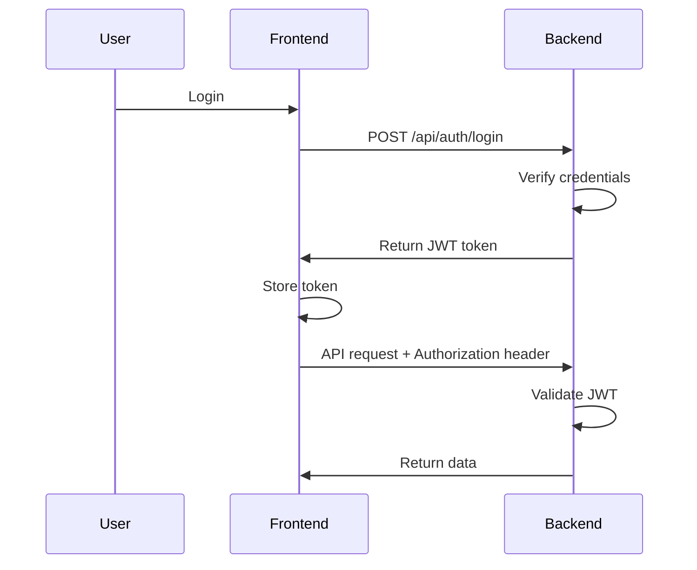
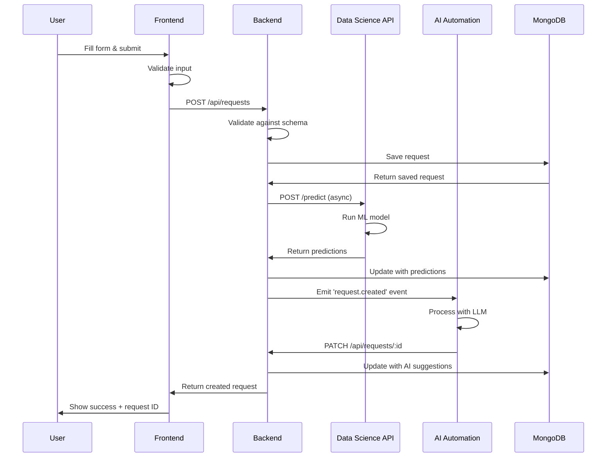
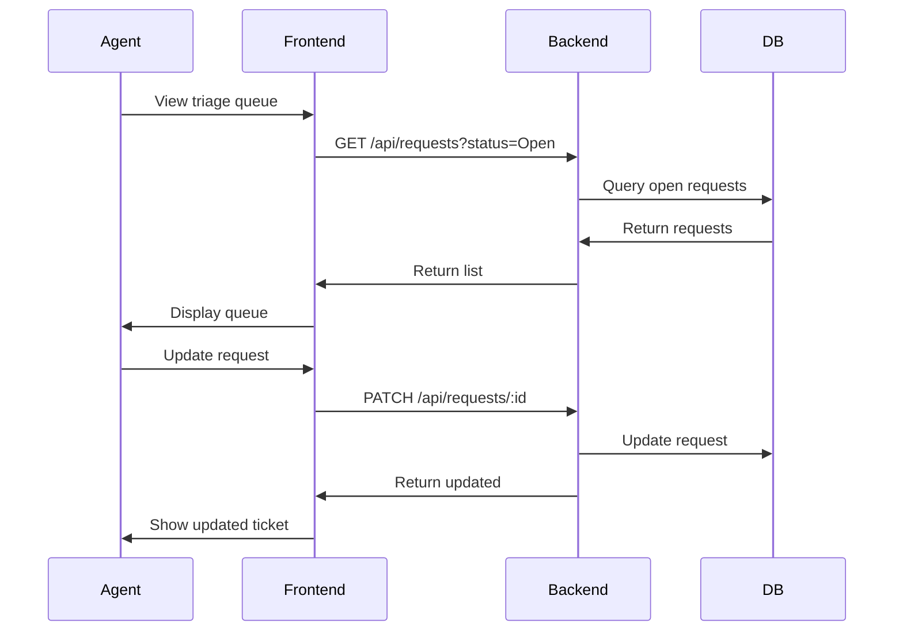
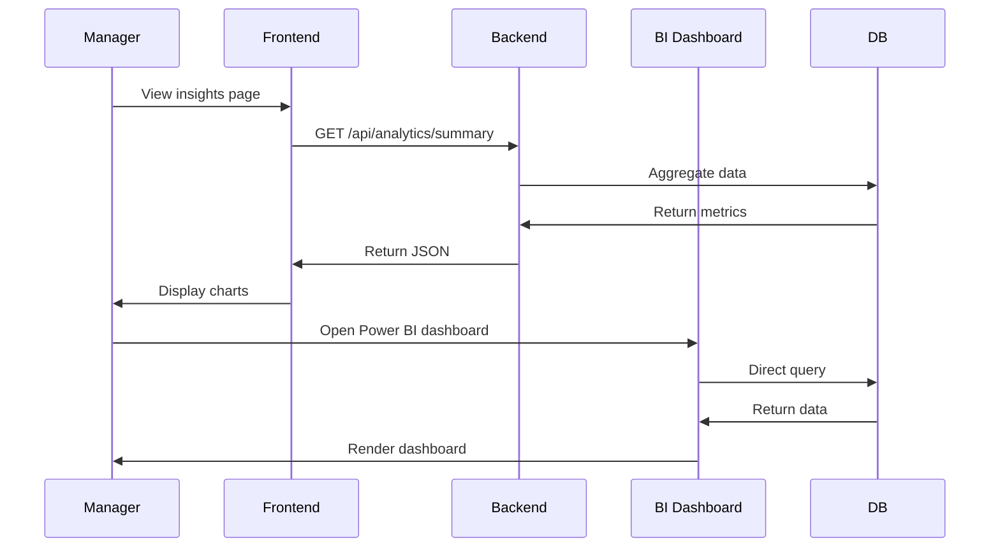
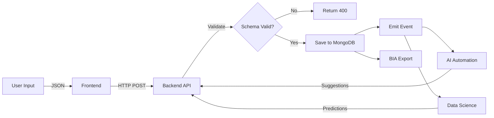
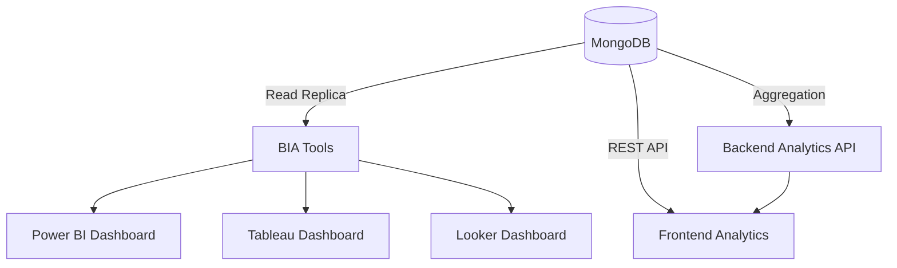

# Integration Guide

This guide explains how different deliverables and disciplines integrate to create the complete Ops Triage Application.

## 🎯 Overview

The Ops Triage system follows a **microservices-inspired architecture** where each discipline delivers components that communicate through well-defined interfaces.



## 🔗 Integration Patterns

### 1. Frontend ↔ Backend (REST API)

**Pattern**: Synchronous HTTP requests

**Contract**: [`api-contract.yml`](../contracts/schemas/api-contract.yml)

#### How It Works

```typescript
// Frontend: packages/frontend/src/services/api.ts
const api = {
  async createRequest(data: CreateRequestDTO): Promise<Request> {
    const response = await fetch(`${API_URL}/api/requests`, {
      method: 'POST',
      headers: { 'Content-Type': 'application/json' },
      body: JSON.stringify(data)
    });
    return response.json();
  }
};

// Backend: packages/backend/src/routes/requests.routes.ts
router.post('/api/requests', validateRequest, async (req, res) => {
  const request = await RequestService.create(req.body);
  res.status(201).json(request);
});
```

#### Key Endpoints

| Method | Endpoint | Purpose | Frontend Usage |
|--------|----------|---------|----------------|
| `POST` | `/api/requests` | Create request | Intake form submission |
| `GET` | `/api/requests` | List requests | Triage queue, dashboards |
| `GET` | `/api/requests/:id` | Get single request | Detail page |
| `PATCH` | `/api/requests/:id` | Update request | Status changes, assignments |
| `POST` | `/api/triage` | Trigger auto-triage | Manual triage button |
| `GET` | `/api/analytics/*` | Analytics data | Insights page |

#### Error Handling

```typescript
// Frontend handles API errors consistently
try {
  const request = await api.createRequest(formData);
} catch (error) {
  if (error.status === 400) {
    // Validation errors - show to user
  } else if (error.status === 500) {
    // Server error - show generic message
  }
}
```

#### Authentication Flow



### 2. Backend ↔ Data Science (ML Model API)

**Pattern**: Synchronous HTTP requests for predictions

**Contract**: [`ds-model-output.schema.json`](../contracts/integration-points/ds-model-output.schema.json)

#### How It Works

```typescript
// Backend calls DS API: packages/backend/src/services/request.service.ts
async function autoTriage(requestId: string) {
  const request = await RequestModel.findById(requestId);
  
  // Call Data Science model
  const prediction = await fetch(`${DS_API_URL}/predict`, {
    method: 'POST',
    headers: { 'Content-Type': 'application/json' },
    body: JSON.stringify({
      title: request.title,
      description: request.description,
      department: request.submittedBy.department
    })
  });
  
  const result = await prediction.json();
  
  // Update request with predictions
  request.category = result.predictions.category;
  request.priority = result.predictions.priority;
  if (result.predictions.suggestedAgent) {
    request.assignedTo = result.predictions.suggestedAgent;
  }
  
  await request.save();
  return request;
}
```

```python
# Data Science API: packages/data-science/api/app.py
from fastapi import FastAPI
from pydantic import BaseModel

app = FastAPI()

class PredictionRequest(BaseModel):
    title: str
    description: str
    department: str

@app.post("/predict")
async def predict(request: PredictionRequest):
    # Load model and make predictions
    category = model.predict_category(request.title, request.description)
    priority = model.predict_priority(request.title, request.description)
    
    return {
        "requestId": None,  # Set by backend
        "predictions": {
            "category": category,
            "categoryConfidence": 0.89,
            "priority": priority,
            "priorityConfidence": 0.76,
            "suggestedAgent": None,
            "estimatedResolutionTime": 48
        },
        "modelVersion": "1.0.0",
        "timestamp": datetime.now().isoformat()
    }
```

#### When to Call DS Model

- User submits new request (optional auto-triage)
- Agent clicks "Get AI Suggestion" button
- Bulk prediction on existing requests

#### Fallback Strategy

```typescript
async function triageWithFallback(requestId: string) {
  try {
    // Try DS model first
    return await callDSModel(requestId);
  } catch (error) {
    // If DS unavailable, use rule-based fallback
    return await ruleBasedTriage(requestId);
  }
}
```

### 3. Backend ↔ AI Automation (Event-Driven)

**Pattern**: Webhook events (publish-subscribe)

**Contract**: [`webhook-events.schema.json`](../contracts/integration-points/webhook-events.schema.json)

#### How It Works

```typescript
// Backend emits events: packages/backend/src/services/webhook.service.ts
class WebhookService {
  async emit(eventType: string, payload: any) {
    const event = {
      eventType,
      timestamp: new Date().toISOString(),
      payload,
      metadata: {
        source: 'backend-api',
        version: '1.0'
      }
    };
    
    // Send to all subscribers
    const subscribers = await this.getSubscribers(eventType);
    await Promise.all(
      subscribers.map(sub => this.sendWebhook(sub.url, event))
    );
  }
}

// Emit on request creation
await webhookService.emit('request.created', request);
```

```typescript
// AI Automation subscribes: packages/ai-automation/src/automation.ts
// Receives webhook POST at /webhooks/backend
app.post('/webhooks/backend', async (req, res) => {
  const { eventType, payload } = req.body;
  
  if (eventType === 'request.created') {
    // Process new request through LLM
    const aiSuggestion = await processWithLLM(payload);
    
    // Send results back to backend
    await fetch(`${BACKEND_URL}/api/requests/${payload.id}`, {
      method: 'PATCH',
      body: JSON.stringify({
        aiSuggestions: aiSuggestion,
        category: aiSuggestion.category,
        priority: aiSuggestion.priority
      })
    });
  }
  
  res.sendStatus(200);
});
```

#### Supported Events

| Event | Trigger | Payload | AI Automation Use |
|-------|---------|---------|-------------------|
| `request.created` | New request | Full request object | Auto-categorize, prioritize |
| `request.updated` | Field changed | Request + changed fields | Re-evaluate if needed |
| `request.assigned` | Assigned to agent | Request + agent | Notify agent via AI |
| `request.resolved` | Marked resolved | Request + resolution | Learn from resolution |

#### Webhook Reliability

```typescript
// Retry failed webhooks with exponential backoff
async sendWebhookWithRetry(url: string, event: any, maxRetries = 3) {
  for (let i = 0; i < maxRetries; i++) {
    try {
      await fetch(url, {
        method: 'POST',
        headers: { 'Content-Type': 'application/json' },
        body: JSON.stringify(event),
        timeout: 5000
      });
      return; // Success
    } catch (error) {
      if (i === maxRetries - 1) throw error;
      await sleep(Math.pow(2, i) * 1000); // Exponential backoff
    }
  }
}
```

### 4. Backend → BIA (Data Export)

**Pattern**: Database access or CSV export

**Contract**: Request schema + analytics queries

#### How It Works

**Option 1: Direct Database Access** (Recommended)

```javascript
// BIA connects to MongoDB read replica
// packages/bia/data/load-seed-data.js
const { MongoClient } = require('mongodb');

const client = new MongoClient(process.env.MONGODB_URI);
await client.connect();
const requests = await client.db('ops-triage')
  .collection('requests')
  .find({})
  .toArray();

// Export to CSV for BI tools
exportToCSV(requests, 'requests-export.csv');
```

**Option 2: Analytics API**

```typescript
// Backend provides analytics endpoints
router.get('/api/analytics/requests/summary', async (req, res) => {
  const summary = await RequestModel.aggregate([
    { $group: {
      _id: '$category',
      count: { $sum: 1 },
      avgResolutionTime: { $avg: '$resolutionTime' }
    }}
  ]);
  res.json(summary);
});
```

#### BIA Data Refresh Strategy

```javascript
// Scheduled export every hour
cron.schedule('0 * * * *', async () => {
  const requests = await fetchFromBackend('/api/requests');
  await updatePowerBIDataset(requests);
});
```

### 5. UX Design → Frontend (Design Handoff)

**Pattern**: Design system + Figma specs

**Contract**: Design tokens, component specs, flows

#### How It Works

```json
// UX provides design tokens: packages/ux-design/design-system/tokens.json
{
  "colors": {
    "primary": "#1E40AF",
    "success": "#10B981",
    "error": "#EF4444"
  },
  "spacing": {
    "xs": "4px",
    "sm": "8px",
    "md": "16px"
  },
  "typography": {
    "fontFamily": "Inter, sans-serif",
    "h1": { "size": "32px", "weight": "700" }
  }
}
```

```typescript
// Frontend consumes design tokens
// packages/frontend/src/styles/theme.ts
import tokens from '@ux-design/design-system/tokens.json';

export const theme = {
  colors: tokens.colors,
  spacing: tokens.spacing,
  typography: tokens.typography
};
```

#### Component Handoff

UX provides in [`handoff/dev-handoff.md`](../packages/ux-design/handoff/dev-handoff.md):
- Component specifications
- Interaction states (hover, focus, disabled)
- Responsive breakpoints
- Accessibility requirements
- Figma links with measurements

Frontend implements:
```typescript
// Based on UX spec
import { Button } from './components/ui/Button';

<Button variant="primary" size="md" onClick={handleSubmit}>
  Submit Request
</Button>
```

### 6. Security → All Teams (Review & Policies)

**Pattern**: Documentation review + policy enforcement

#### How It Works

Security provides:
- Threat model: [`security/threat-model/STRIDE-analysis.md`](../packages/security/threat-model/STRIDE-analysis.md)
- Policies: [`security/policies/auth-policy.md`](../packages/security/policies/auth-policy.md)
- Review checklist: [`security/checklists/owasp-top-10.md`](../packages/security/checklists/owasp-top-10.md)

Teams implement:
```typescript
// Backend follows security policies
import helmet from 'helmet';
import rateLimit from 'express-rate-limit';

app.use(helmet()); // Security headers
app.use(rateLimit({ windowMs: 15 * 60 * 1000, max: 100 })); // Rate limiting
```

Security reviews:
- Code PRs for vulnerabilities
- API endpoints for auth/authz
- Data handling for sensitive info

### 7. QA → All Teams (Testing & Validation)

**Pattern**: Test execution + bug reporting

#### How It Works

```typescript
// QA writes E2E tests: packages/qa/e2e-tests/tests/submit-flow.spec.ts
test('user can submit request', async ({ page }) => {
  await page.goto('http://localhost:5173');
  await page.click('text=Submit Request');
  await page.fill('[name=title]', 'Laptop not working');
  await page.fill('[name=description]', 'Screen is black');
  await page.click('button:has-text("Submit")');
  
  // Verify request created
  await expect(page.locator('.success-message')).toBeVisible();
});
```

```bash
# QA runs API tests
cd packages/qa
pnpm test:api
pnpm test:e2e
```

QA reports bugs using [`qa/docs/BUG-TEMPLATE.md`](../packages/qa/docs/BUG-TEMPLATE.md) → teams fix → QA verifies.

---

## 🔄 Complete Integration Flow

### User Submits Request Flow



### Agent Triage Flow



### Manager Insights Flow



---

## 🧪 Integration Testing

### Testing Strategies

#### 1. Contract Testing

Verify each component adheres to contracts:

```typescript
// Test backend response matches schema
import { validateRequest } from '@contracts/validators';

test('GET /api/requests returns valid schema', async () => {
  const response = await fetch('/api/requests');
  const data = await response.json();
  
  data.forEach(request => {
    expect(validateRequest(request).valid).toBe(true);
  });
});
```

#### 2. Integration Testing

Test actual component interactions:

```typescript
// Test frontend + backend integration
test('end-to-end request submission', async () => {
  // Frontend submits
  const response = await api.createRequest({
    title: 'Test',
    description: 'Test description'
  });
  
  // Backend stored it
  const stored = await fetch(`/api/requests/${response.id}`);
  expect(stored.status).toBe(200);
});
```

#### 3. Mock Services

Develop without dependencies:

```typescript
// Frontend mocks backend during development
const mockApi = {
  async createRequest(data) {
    return {
      id: 'mock-id',
      ...data,
      createdAt: new Date().toISOString()
    };
  }
};
```

### Integration Checklist

Before final integration:

- [ ] All contracts validated
- [ ] API endpoints return correct schemas
- [ ] Frontend can communicate with backend
- [ ] Backend can call DS API
- [ ] Webhooks successfully deliver to AI Automation
- [ ] BIA can access data
- [ ] E2E tests pass
- [ ] Error handling works across boundaries
- [ ] Performance is acceptable

---

## 🚨 Common Integration Issues

### Issue: CORS Errors

**Symptom**: Frontend can't call backend API

**Solution**:
```typescript
// Backend: packages/backend/src/server.ts
import cors from 'cors';

app.use(cors({
  origin: process.env.FRONTEND_URL || 'http://localhost:5173',
  credentials: true
}));
```

### Issue: Schema Mismatch

**Symptom**: Validation errors, unexpected data

**Solution**:
- Run `npm run validate:contracts`
- Check both sides use same schema version
- Add logging to see actual vs expected data

### Issue: DS API Timeout

**Symptom**: Backend hangs waiting for predictions

**Solution**:
```typescript
// Add timeout to DS API calls
const response = await fetch(DS_API_URL, {
  signal: AbortSignal.timeout(5000) // 5 second timeout
});
```

### Issue: Webhook Not Received

**Symptom**: AI Automation doesn't process events

**Solution**:
- Check AI Automation endpoint is accessible
- Verify webhook URL is registered in backend
- Check firewall/network rules
- Add webhook logging

### Issue: Data Sync Delays

**Symptom**: BIA dashboard shows stale data

**Solution**:
- Reduce refresh interval
- Add real-time export on data changes
- Use database replication for read-only access

---

## 📊 Data Flow Diagrams

### Request Data Flow



### Analytics Data Flow



---

## 🎯 Best Practices

1. **Use Contracts**: Never bypass contracts, even for "quick fixes"
2. **Fail Gracefully**: Handle integration failures with fallbacks
3. **Log Integration Points**: Log all cross-service calls for debugging
4. **Version APIs**: Use API versioning if breaking changes needed
5. **Test Independently**: Each component should work with mocks
6. **Monitor Integration**: Track success/failure rates of integration points
7. **Document Assumptions**: If you assume something about another service, document it

---

## 📚 Related Documentation

- **[Contracts Guide](./CONTRACTS.md)** - Detailed contract specifications
- **[Architecture](./ARCHITECTURE.md)** - Overall system design
- **[Backend API](../packages/backend/docs/API.md)** - API documentation
- **[Data Science Integration](../packages/data-science/docs/INTEGRATION.md)** - DS-specific integration
- **[AI Automation Integration](../packages/ai-automation/docs/INTEGRATION.md)** - AI-specific integration

---

## ✅ Integration Success Criteria

Your integration is successful when:

- ✅ User can submit request through frontend → saves in backend
- ✅ Backend calls DS API → receives predictions
- ✅ Backend emits events → AI Automation receives and processes
- ✅ BIA tools can access and visualize data
- ✅ All data matches contract schemas
- ✅ Error handling works across boundaries
- ✅ Performance meets requirements (< 2s response times)
- ✅ Integration tests pass

**Happy integrating!** 🔗
